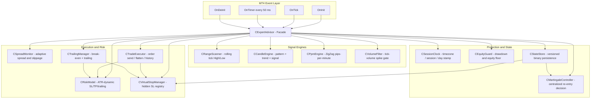
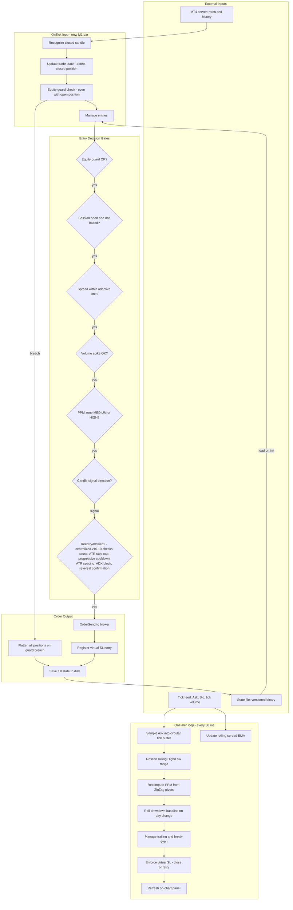
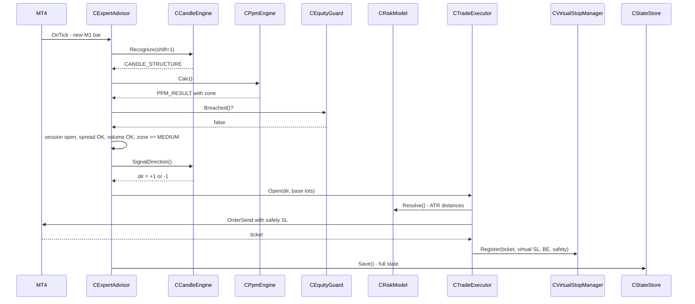
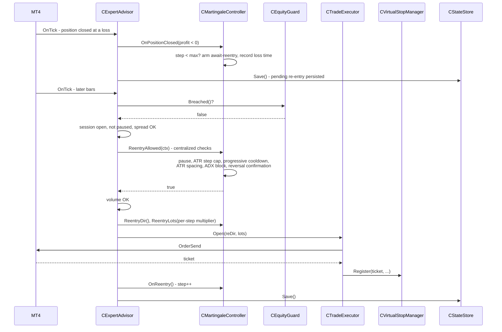
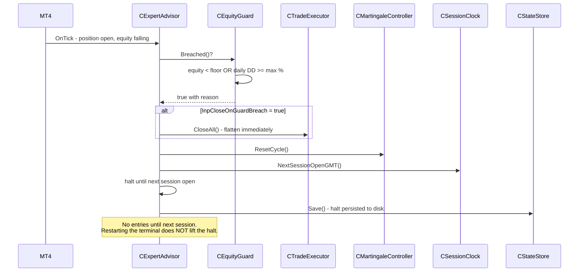
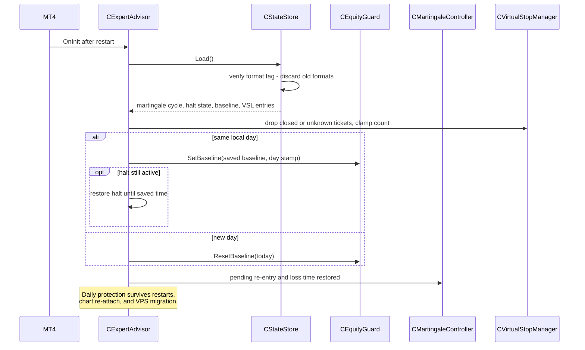

# OneMinuteMan

A MetaTrader 4 Expert Advisor (MQL4) that forces all analysis onto the **M1 (1-minute)** timeframe. It combines a tick-sampled range scanner, a candlestick recognizer, a **PPM (Pips-Per-Minute) efficiency engine**, a tick-volume spike filter, **ATR-dynamic** virtual (hidden) stop losses / take-profit / trailing, **adaptive slippage & max-spread** (from rolling averages, any symbol), **break-even locking**, **equity protection guards**, **martingale cooldown**, and **persistent state recovery**.

> **High-risk software.** This EA uses martingale position sizing and broker-hidden (virtual) stop losses, and re-entries after a loss. These dramatically increase blow-up risk. Use on a demo account first. Nothing here is financial advice.

---

## Table of Contents

- [Product Requirements Document](#product-requirements-document)
- [Architecture Blueprint](#architecture-blueprint)
- [Data Dictionary](#data-dictionary)
- [Data Flow Diagram](#data-flow-diagram)
- [UML Sequence Diagrams](#uml-sequence-diagrams)
- [How It Works](#how-it-works)
- [Signal Logic](#signal-logic)
- [Martingale Modes](#martingale-modes)
- [Dynamic Risk (ATR)](#dynamic-risk-atr)
- [Break-Even & Safety Net](#break-even--safety-net)
- [Equity Protection](#equity-protection)
- [Adaptive Execution](#adaptive-execution)
- [State Persistence](#state-persistence)
- [Installation](#installation)
- [User Guide](#user-guide)
- [Inputs](#inputs)
- [Risk Warnings](#risk-warnings)
- [Changelog](#changelog)

---

## Product Requirements Document

### PRD-001 — Overview
| Field | Value |
|---|---|
| **Product Name** | OneMinuteMan |
| **Version** | 10.10 |
| **Platform** | MetaTrader 4 (MQL4) |
| **Timeframe** | M1 (forced) |
| **Strategy Type** | Scalping + Martingale Recovery |
| **Architecture** | Single-file component design (Facade + 13 SRP classes) |
| **Risk Level** | High |

### PRD-002 — Functional Requirements

| ID | Requirement | Priority | Status |
|---|---|---|---|
| FR-001 | Sample tick data into a rolling circular buffer every N milliseconds | P0 | Implemented |
| FR-002 | Compute rolling High/Low range from tick samples | P0 | Implemented |
| FR-003 | Recognize 10 candlestick patterns on the last closed M1 bar | P0 | Implemented |
| FR-004 | Determine trend direction against SMA | P0 | Implemented |
| FR-005 | Calculate PPM (Pips-Per-Minute) via ZigZag pivot analysis | P0 | Implemented |
| FR-006 | Gate entries with tick-volume spike filter | P0 | Implemented |
| FR-007 | ATR-dynamic SL, TP, and trailing stop distances | P0 | Implemented |
| FR-008 | Virtual (hidden) stop-loss with broker-side safety SL | P0 | Implemented |
| FR-009 | Break-even trigger with configurable lock pips | P0 | Implemented |
| FR-010 | Adaptive max-spread and slippage from rolling EMA | P0 | Implemented |
| FR-011 | Martingale re-entry (SAME or REVERSE direction) | P0 | Implemented |
| FR-012 | Martingale cooldown bars between steps | P0 | Implemented |
| FR-013 | Session-based trading window with daily halt | P0 | Implemented |
| FR-014 | Equity drawdown guard — halt at max daily drawdown % | P0 | Implemented |
| FR-015 | Minimum equity floor guard | P0 | Implemented |
| FR-016 | Persistent state save/load across EA restarts | P0 | Implemented |
| FR-017 | Real-time on-chart info panel | P1 | Implemented |
| FR-018 | Input validation with error codes on init | P1 | Implemented |
| FR-019 | Persist daily halt, halt-until time, and drawdown baseline across restarts | P0 | Implemented (v10) |
| FR-020 | Evaluate equity guards on every tick, including with open positions | P0 | Implemented (v10) |
| FR-021 | Optionally flatten all positions on guard breach (`InpCloseOnGuardBreach`) | P0 | Implemented (v10) |
| FR-022 | Retry virtual-SL close on broker rejection instead of dropping protection | P0 | Implemented (v10) |
| FR-023 | Centralize all martingale re-entry checks in a single decision point | P0 | Implemented (v10.10) |
| FR-024 | Progressive per-step cooldown and decaying multiplier schedules | P1 | Implemented (v10.10) |
| FR-025 | Consecutive-loss limiter pausing all entries, persisted across restarts | P0 | Implemented (v10.10) |
| FR-026 | Block martingale during strong trends (ADX) and require price spacing / reversal confirmation | P0 | Implemented (v10.10) |
| FR-027 | Mode-aware ADX gate: SAME blocks in strong trends, REVERSE requires a confirmed trend | P0 | Implemented (v10.11) |

### PRD-003 — Non-Functional Requirements

| ID | Requirement | Target |
|---|---|---|
| NFR-001 | Timer tick latency | < 50ms |
| NFR-002 | Virtual SL enforcement latency | < 50ms |
| NFR-003 | Memory footprint | < 10MB |
| NFR-004 | Symbol agnostic (no hardcoded pairs) | 100% |
| NFR-005 | Graceful degradation on missing ZigZag | Fail on init |
| NFR-006 | State recovery time | < 100ms |
| NFR-007 | State file format | Versioned (tagged); old formats discarded safely |

### PRD-004 — Signal Entry Conditions (ALL must be true)
1. Trading enabled (`InpEnableTrading = true`)
2. No open position on the symbol
3. Inside session hours
4. Spread within adaptive limit
5. PPM zone is MEDIUM or HIGH
6. Tick volume >= multiplier x average
7. Candle produces a directional signal
8. Equity guard passes (drawdown + minimum equity)

### PRD-005 — Martingale Re-Entry Conditions (ALL must be true)
1. Previous trade was a loss
2. Martingale step < max steps (initial trade = step 0, so max steps = number of re-entries)
3. Martingale cooldown bars elapsed
4. Volume filter passes
5. Equity guard passes
6. Session is open
7. Spread is acceptable

---

## Architecture Blueprint

Single `.mq4` file, component-based. The MT4 event handlers delegate to a **`CExpertAdvisor` facade**, which wires 13 single-responsibility components.



### Component Responsibilities

| Component | Responsibility | Key Methods |
|---|---|---|
| **CSpreadMonitor** | Rolling spread EMA; adaptive max-spread & slippage | `Update()`, `SpreadOK()`, `EffSlippage()`, `EffMaxSpread()` |
| **CRangeScanner** | Rolling tick window and High/Low range | `Sample()`, `High()`, `Low()`, `Range()` |
| **CCandleEngine** | Classify candlestick patterns and trend; derive signal | `Recognize()`, `SignalDirection()` |
| **CPpmEngine** | Market efficiency via ZigZag pivots; init verification | `Calc()`, `VerifyIndicator()` |
| **CVolumeFilter** | Gate entries on tick-volume spikes | `Ok()` |
| **CSessionClock** | Timezone, session window, local day stamp | `InSession()`, `LocalDayStamp()`, `NextSessionOpenGMT()` |
| **CEquityGuard** | Daily drawdown & minimum-equity protection, day-stamped baseline | `Breached()`, `RollDayIfNeeded()`, `SetBaseline()` |
| **CRiskModel** | ATR-dynamic SL/TP/trailing/break-even distances | `Resolve()`, `AtrPips()` |
| **CVirtualStopManager** | Hidden SL registry, enforcement with retry, tighten-only updates | `Register()`, `Enforce()`, `Tighten()` |
| **CTrailingManager** | ATR trailing + break-even lock (virtual or broker SL) | `Manage()` |
| **CMartingaleController** | Loss-recovery state machine; **all** re-entry protections centralized in one decision point (v10.10) | `OnPositionClosed()`, `ReentryAllowed()`, `EntryPaused()`, `ReentryDir()`, `ReentryLots()` |
| **CTradeExecutor** | Order send with dynamic params, emergency flatten, history scan | `Open()`, `CloseAll()`, `CountPositions()`, `LastClosedProfit(&closePrice)` |
| **CStateStore** | Versioned binary save/load of full protection state (Memento) | `Save()`, `Load()` |

---

## Data Dictionary

### Structures

| Structure | Field | Type | Description |
|---|---|---|---|
| `CANDLE_STRUCTURE` | `type` | `TYPE_CANDLESTICK` | Classified pattern of the closed M1 bar |
| | `unit` | `TYPE_TREND` | Trend of close vs. SMA(`InpAverPeriod`) |
| | `bodysize` | `double` | Absolute body size |
| | `shade_high` / `shade_low` | `double` | Upper / lower wick length |
| | `avg_close` / `avg_body` | `double` | SMA of closes / average body over period |
| | `open` `high` `low` `close` | `double` | OHLC of the classified bar |
| `PPM_RESULT` | `ppm` | `double` | Pips per minute of the last ZigZag leg |
| | `pips` | `double` | Pip distance of the leg |
| | `atr_ratio` | `double` | `ppm / InpAtrDailyRef` (display only) |
| | `candles` | `int` | M1 bars spanned by the leg |
| | `zone` | `PPM_ZONE` | Efficiency zone classification |
| | `pivot_start` / `pivot_end` | `datetime` | Leg boundary times |
| `VSL_ENTRY` | `ticket` | `int` | Order ticket being protected |
| | `dir` | `int` | +1 long / -1 short |
| | `vsl_price` | `double` | Hidden stop-loss price |
| | `be_price` | `double` | Break-even lock price |
| | `safety_sl_price` | `double` | Wide broker-side safety SL |
| | `active` | `bool` | Entry currently enforced |
| | `fail_count` | `int` | Failed close attempts (retry counter) |
| `TRADE_PARAMS` | `tp_pips` `sl_pips` | `double` | Resolved TP / SL distances |
| | `trail_start` `trail_step` | `double` | Trailing activation / step distances |
| | `be_trigger` | `double` | Break-even trigger distance |
| `REENTRY_CONTEXT` (v10.10) | `atr_pips` | `double` | Current ATR in pips (0 = unavailable) |
| | `adx` | `double` | ADX(M1) on last closed bar (0 = unavailable / iADX error → gate skipped) |
| | `price` | `double` | Current Bid |
| | `candle_dir` | `int` | Candle signal direction (+1/-1/0) |
| | `ppm_zone` | `int` | `PPM_ZONE` value, -1 = invalid |
| | `new_bar_since_loss` | `bool` | At least one new M1 bar since the losing close |

### Enumerations

| Enum | Values |
|---|---|
| `ENUM_MART_MODE` | `MART_SAME_DIRECTION` (0), `MART_REVERSE_DIRECTION` (1) |
| `TYPE_CANDLESTICK` | `CAND_UNKNOWN`, `CAND_LONG`, `CAND_SHORT`, `CAND_DOJI`, `CAND_MARUBOZU`, `CAND_HAMMER`, `CAND_INVERTED_HAMMER`, `CAND_SPINNING_TOP`, `CAND_DRAGONFLY_DOJI`, `CAND_GRAVESTONE_DOJI`, `CAND_LONG_LEGGED_DOJI` |
| `TYPE_TREND` | `TREND_UNKNOWN`, `TREND_UPPER`, `TREND_DOWN`, `TREND_LATERAL` |
| `PPM_ZONE` | `PPM_ZONE_NONE`, `PPM_ZONE_LOW`, `PPM_ZONE_MEDIUM`, `PPM_ZONE_HIGH` |
| `ENUM_MART_CONFIRM` (v10.10) | `MART_CONFIRM_NONE` (0), `MART_CONFIRM_CANDLE` (1), `MART_CONFIRM_PPM` (2), `MART_CONFIRM_EITHER` (3), `MART_CONFIRM_BOTH` (4) |

### State File Format — `OMM_State_<Symbol>_<Magic>.bin`

Binary, written on every trade, every halt, and deinit. Read order:

| # | Field | Type | Notes |
|---|---|---|---|
| 1 | Format tag | `int` | `0x4F4D4D34` ("OMM4") — old/unknown tags are discarded safely |
| 2 | Martingale step | `int` | Initial trade = 0 |
| 3 | Last direction | `int` | +1 / -1 |
| 4 | Last lot size | `double` | |
| 5 | Await-reentry flag | `int` | 0 / 1 |
| 6 | Last loss time | `long` | Unix time |
| 6a | Consecutive losses | `int` | Cross-cycle loss streak (v10.10) |
| 6b | Pause-until time | `long` | Consecutive-loss pause deadline, Unix time (v10.10) |
| 6c | Last loss price | `double` | Losing close price for ATR spacing (v10.10) |
| 7 | Halted flag | `int` | 0 / 1 |
| 8 | Halt-until time | `long` | GMT Unix time |
| 9 | Drawdown baseline | `double` | Day-start balance |
| 10 | Day stamp | `int` | Local `yyyymmdd` of the baseline |
| 11 | VSL entry count | `int` | Clamped to capacity on load |
| 12+ | Per VSL entry | `int, int, double, double, double` | ticket, dir, vsl, be, safety |

### Key Inputs Cross-Reference

Full input tables live in [Inputs](#inputs); the data-critical ones:

| Input | Consumed by | Effect |
|---|---|---|
| `InpWindowSize` | CRangeScanner | Circular buffer capacity |
| `InpZzDepth/Deviation/Backstep` | CPpmEngine | ZigZag pivot parameters |
| `InpAtrSLMult` etc. | CRiskModel | Distance formulas |
| `InpMartMaxSteps` | CMartingaleController | Number of re-entries |
| `InpMaxDrawdownPct`, `InpMinEquity`, `InpCloseOnGuardBreach` | CEquityGuard / facade | Protection thresholds & breach behavior |
| `InpMartCooldownSchedule`, `InpMartMultSchedule` | CMartingaleController | Progressive per-step cooldown / multiplier (parsed at init) |
| `InpMaxConsecLosses`, `InpConsecLossPauseMin` | CMartingaleController | Consecutive-loss limiter pausing **all** entries |
| `InpMartMaxADX`, `InpMartMinAtrDist`, `InpMartConfirm` | CMartingaleController | Trend block, ATR price spacing, reversal confirmation |

---

## Data Flow Diagram



---

## UML Sequence Diagrams

### Fresh Entry Sequence



### Martingale Re-Entry Sequence



### Equity Protection Trigger Sequence



### Restart Recovery Sequence



---

## How It Works

Two event handlers drive the EA:

- **`OnTimer()`** (every `InpSampleMs`, default 50 ms): samples Ask into a circular buffer, updates the rolling average spread (`g_spread_ema`), recomputes the range and PPM, manages trailing stops, enforces the virtual SL, and refreshes the on-chart panel.
- **`OnTick()`** (each new M1 bar): recognizes the closed candle, updates cycle state (detecting closed positions and arming martingale if needed), and evaluates entries.

### Engines

| Engine | Purpose |
|---|---|
| Range Scanner | ~60 s rolling high/low from tick samples (informational panel). |
| Candle Recognizer | Classifies the last closed M1 candle + trend vs. SMA. |
| PPM Engine | Efficiency = pip distance of last ZigZag(2-2-1) leg / M1 candles elapsed. |
| Trade Module | Orders, ATR-dynamic virtual SL/TP/trailing, volume filter, adaptive execution, session gating, martingale, equity guards, break-even, safety SL. |

---

## Signal Logic

A fresh trade opens only when **all** conditions hold:

1. `InpEnableTrading = true`
2. No open position on the symbol
3. Inside session hours
4. Spread within the adaptive limit
5. Equity guard passes (min equity + drawdown check)
6. PPM zone is MEDIUM or HIGH
7. Tick volume >= `InpVolMultiplier` x average
8. The candle produces a directional signal

### Candle Signals

| Pattern | Direction | Condition |
|---|---|---|
| Hammer | LONG | Bullish reversal signal |
| Dragonfly Doji | LONG | Bullish reversal signal |
| Inverted Hammer | SHORT | Bearish reversal signal |
| Gravestone Doji | SHORT | Bearish reversal signal |
| Long / Marubozu + Ascending | LONG | Trend continuation |
| Long / Marubozu + Descending | SHORT | Trend continuation |

---

## Martingale Modes

After a losing trade the EA arms a re-entry. Since **v10.10 every martingale attempt passes through one centralized decision point** — `CMartingaleController::ReentryAllowed()` — which runs all protection checks in order of cost before any order is sent. The re-entry lot size comes from the per-step multiplier schedule (or fixed `InpMartMult`), and the direction is controlled by **`InpMartMode`**:

| Mode | Value | Behavior |
|---|---|---|
| `MART_SAME_DIRECTION` | 0 | Classic martingale — re-enter the **same** direction as the losing trade (average down). |
| `MART_REVERSE_DIRECTION` | 1 | **Reverse** martingale — re-enter the **opposite** direction. Because the tracked direction flips each step, consecutive re-entries alternate. |

Both modes stop after `InpMartMaxSteps` **re-entries** (the initial trade is step 0) and then halt trading until the next session open. The halt itself is persisted to disk, so restarting the terminal does not lift it.

### Centralized Re-Entry Protections (v10.10)

Every re-entry must pass **all** of these, evaluated inside `ReentryAllowed()`:

| # | Check | Input(s) | Behavior |
|---|---|---|---|
| 1 | Consecutive-loss pause | `InpMaxConsecLosses`, `InpConsecLossPauseMin` | N losses in a row (across cycles, reset on any win) pause **all** entries — fresh and martingale — for the configured minutes. Persisted across restarts. |
| 2 | ATR-adaptive step cap | `InpMartAtrLowPips`, `InpMartAtrHighPips` | High volatility reduces exposure: full steps at low ATR, one fewer at medium, only 2 above the high threshold. `0` disables. |
| 3 | Progressive cooldown | `InpMartCooldownSchedule` (default `0,1,2,3,5`) | Per-step bar cooldown — slows down only as risk increases. Empty schedule falls back to fixed `InpMartCooldownBars`. |
| 4 | New-bar / ATR spacing floor | `InpMartMinAtrDist` (default 0.5) | Even at a 0-bar cooldown, a same-bar re-entry requires price to have moved >= ATR x factor away from the losing close. Set to 0 to force a new M1 bar instead. Prevents rapid-fire entries within 2 pips. |
| 5 | ADX trend gate (mode-aware, v10.11) | `InpMartMaxADX` (default 30), `InpMartADXPeriod` | SAME: no re-entry while ADX(M1) is **above** the limit (don't average against a trend). REVERSE: no re-entry while ADX is **below** the limit (only reverse *with* a confirmed trend). `0` or ADX unavailable disables. |
| 6 | Reversal confirmation | `InpMartConfirm` (default `EITHER`) | Re-entry must be confirmed by the existing signal engines: candle signal agreeing with the re-entry direction and/or PPM zone >= MEDIUM. Modes: `NONE` / `CANDLE` / `PPM` / `EITHER` / `BOTH`. |

### Decaying Multiplier Schedule
`InpMartMultSchedule` (e.g. `2.0,1.8,1.6,1.4,1.2`) replaces the fixed multiplier with a per-step schedule — later rungs grow slower, cutting worst-case drawdown dramatically. Empty = fixed `InpMartMult`.

---

## Dynamic Risk (ATR)

Stop loss, take profit, and trailing values are derived from the recent **M1 ATR** so they adapt to current volatility:

- `SL pips = ATR(pips) x InpAtrSLMult`
- `TP pips = ATR(pips) x InpAtrTPMult`
- `Trailing activation = ATR(pips) x InpAtrTrailStartMult`
- `Trailing distance = ATR(pips) x InpAtrTrailStepMult`
- A floor (`InpMinRiskPips`) prevents zero/near-zero values when ATR is tiny.

Each of `InpSL_Pips`, `InpTP_Pips`, `InpTrailStart`, `InpTrailStep` acts as a manual override: set it above 0 to use a fixed value instead of the ATR-derived one.

---

## Break-Even & Safety Net

### Break-Even
When price moves favorably by `ATR x InpBE_TriggerMult`, the SL is moved to the entry price + `InpBE_LockPips` (in profit), locking in gains.

### Safety SL (Disconnect Protection)
When `InpHideSL = true` and `InpUseSafetySL = true`, a wide broker-side stop loss is still sent to the server at `Virtual SL distance x InpSafetySLMult`. This protects against catastrophic losses if the terminal disconnects, while the tighter virtual SL remains hidden from the broker during normal operation.

---

## Equity Protection

Two guards protect the account from excessive losses. Since v10 they are evaluated on **every tick — including while a position is open** — not only before new entries.

### 1. Maximum Daily Drawdown (`InpMaxDrawdownPct`)
If the account equity drops by more than the configured percentage from the local-day starting balance, all trading halts until the next session open. The baseline is anchored to the **local calendar day** (day-stamped) and is **persisted to disk**, so neither a chart re-attach nor a full terminal restart can re-anchor it mid-day.

### 2. Minimum Equity Floor (`InpMinEquity`)
If account equity falls below this absolute value, trading halts immediately until the next session.

### Breach Behavior (`InpCloseOnGuardBreach`)
When a guard breaches while positions are open and `InpCloseOnGuardBreach = true` (default), the EA immediately flattens all its positions, resets the martingale cycle, and halts for the day. Set it to `false` to only block new entries (v9 behavior).

---

## Adaptive Execution

Max allowed spread and slippage are computed from a **rolling EMA of the live spread** (in points), so the EA works on **any symbol** without hardcoded gold/EUR profiles:

- `Max spread = avg spread(points) x InpMaxSpreadMult`
- `Slippage = avg spread(points) x InpSlippageMult`
- `InpSprEmaAlpha` controls how quickly the average adapts.
- `InpMaxSpread` / `InpSlippage` act as manual overrides when set above 0.

---

## State Persistence

The full protection state is automatically saved to a versioned binary file (`OMM_State_<Symbol>_<Magic>.bin`) on every trade, on every halt, and on deinitialization:

- Martingale cycle: step count, direction, lot size, **pending re-entry flag and loss timestamp**
- **Daily halt flag and halt-until time** — a restart can no longer bypass the daily drawdown halt
- **Drawdown baseline and its local-day stamp** — restarting mid-day keeps the same baseline; a new day gets a fresh one
- Virtual SL entries

On `OnInit()`, the state is loaded back, allowing the EA to resume correctly after:

- MT4 terminal restart
- Chart re-attachment
- VPS migration
- EA recompilation

The file starts with a format tag; state files from v9 or older fail the tag check and are discarded safely (fresh start). Closed positions are filtered out during load and the entry count is clamped, so only active virtual SL entries are recovered.

---

## Installation

1. Copy `oneminuteman.mq4` into `MQL4/Experts/`.
2. Ensure the built-in **ZigZag** indicator is available in `MQL4/Indicators/`.
3. Restart MetaTrader 4 or refresh the Navigator, then compile in MetaEditor.
4. Attach to any chart (analysis is forced to M1) and allow automated trading.
5. Keep `InpEnableTrading = false` until you have demo-tested.

---

## User Guide

### Quick Start (5 minutes)

1. **Install** (see [Installation](#installation)) and compile in MetaEditor — expect **0 errors, 0 warnings**.
2. Attach to an **M1 chart** of a major pair on a **demo account**. The EA forces M1 analysis regardless of chart timeframe.
3. Leave every input at its default. Defaults are the tested, protected configuration.
4. Watch the on-chart panel for one full session with `InpEnableTrading = false` — confirm PPM, candle patterns, and spread readings look sane for your broker.
5. Set `InpEnableTrading = true` and let it run on demo for **at least 2–4 weeks** before considering anything else.

### Reading the On-Chart Panel

```
=== OneMinuteMan v10.10 ===
Symbol:EURUSD  Engines:M1 (forced)  Chart:M1
--- Range ---            <- rolling tick High/Low window
--- Candle ---           <- last classified pattern + trend
PPM:1.25  Zone:MEDIUM    <- market efficiency (ZigZag pips/minute)
--- Trade ---
Trading:ON  Spread:12/32  Equity:$1000.00  DD:1.20%
Open:1  Mart:2/5 (SAME) [AWAIT]
ConsecLosses:2  Block:ATR price spacing
Session: OPEN  HideSL:ON  VSLs:1
```

| Line | Meaning |
|---|---|
| `Spread:12/32` | Current spread / adaptive limit (points). Entries blocked above the limit |
| `Mart:2/5 (SAME) [AWAIT]` | Martingale step 2 of max 5, same-direction mode, re-entry armed |
| `ConsecLosses:2` | Cross-cycle loss streak. At `InpMaxConsecLosses` (default 3) **all** entries pause |
| `PAUSED until hh:mm` | Consecutive-loss pause active — no entries, fresh or martingale |
| `Block:<reason>` | Why the armed re-entry has not fired yet (cooldown, ATR spacing, ADX block, no reversal confirmation…) |
| `HALTED until: <time>` | Daily halt active (guard breach or ladder exhausted). Survives restarts |

### Choosing a Risk Profile

| Input | Conservative | Default | Aggressive (demo only) |
|---|---|---|---|
| `InpUseMartingale` | **false** | true | true |
| `InpMartMaxSteps` | 2 | 5 | 5 |
| `InpMartMultSchedule` | `1.5,1.5` | `""` (fixed 2.0) | `2.0,1.8,1.6,1.4,1.2` |
| `InpMartCooldownSchedule` | `2,3,5` | `0,1,2,3,5` | `0,1,2,3,5` |
| `InpMaxConsecLosses` | 2 | 3 | 3 |
| `InpMaxDrawdownPct` | 5 | 10 | 10 |
| `InpMartConfirm` | `BOTH` | `EITHER` | `EITHER` |
| `InpMartMaxADX` | 25 | 30 | 30 |

Worst-case cumulative exposure with fixed 2.0 multiplier: 3× base lots at 1 step, 7× at 2, 63× at 5. Size `InpBaseLots` so the **full ladder** fits inside your `InpMaxDrawdownPct`.

### What Happens After a Loss (v10.10 flow)

1. Loss detected → streak +1, re-entry armed (if steps remain), losing close price recorded.
2. If streak ≥ `InpMaxConsecLosses` → **all entries pause** for `InpConsecLossPauseMin` minutes.
3. Otherwise, the re-entry must pass **every** centralized check: progressive cooldown → new-bar/ATR-spacing floor → mode-aware ADX trend gate → candle/PPM reversal confirmation → volume filter.
4. If the last rung loses → trading halts for the day. If daily drawdown or the equity floor breaches at any tick → positions are flattened (`InpCloseOnGuardBreach`) and trading halts until next session.
5. Any win resets both the ladder and the loss streak.

### Frequently Asked Questions

**The EA doesn't trade at all.** Check the panel: `Trading:OFF` (input disabled), `Session: CLOSED` (outside `InpSessionStartHour`–`InpSessionEndHour`, timezone offset `InpTzOffsetHours`), `HALTED` (daily protection), `Zone:LOW/NONE` (PPM too inefficient — this is by design), or spread above the adaptive limit.

**`Mart` shows `[AWAIT]` but nothing happens.** Read the `Block:` reason on the panel — the centralized protections are holding the re-entry until conditions are safe. This is normal and intended.

**Can I set `InpMartCooldownBars = 0`?** The fallback value only applies when `InpMartCooldownSchedule` is empty, and since v10.10 even a 0-bar cooldown cannot fire a same-bar re-entry unless price has moved ≥ ATR × `InpMartMinAtrDist` from the losing close. Negative values fail init.

**Where is my stop-loss?** Hidden by default (`InpHideSL = true`): the EA enforces a virtual SL internally and sends only a wide safety SL to the broker. Disable `InpHideSL` to use plain broker stops.

**I restarted the terminal — did I lose protection?** No. Ladder state, loss streak, pause, daily halt, and drawdown baseline are all restored from the state file (`OMM_State_<Symbol>_<Magic>.bin` in `MQL4/Files/`). Delete that file only if you deliberately want a factory reset.

**Can I run it on multiple pairs?** Yes — one chart per symbol; state files are per symbol + magic. Use a distinct `InpMagic` per chart and remember the equity guards read **account-level** equity, so guards on any chart can halt that chart only.

### Golden Rules

1. **Demo first, always.** No live money until you have weeks of demo history.
2. **Never disable the protections to "let it recover".** They exist because martingale's worst case is account-ending.
3. Size `InpBaseLots` for the full ladder, not the first trade.
4. Prefer ranging sessions; the ADX block helps, but don't fight it.
5. After any large loss, review the log — every blocked re-entry prints its reason.

---

## Inputs

### Range / Candle / PPM
| Input | Default | Description |
|---|---|---|
| `InpSampleMs` | 50 | Tick sampling interval in milliseconds |
| `InpWindowSize` | 1200 | Circular buffer size (1200 x 50ms = 60s) |
| `InpAverPeriod` | 14 | SMA period for trend + average body calc |
| `InpZzDepth/Deviation/Backstep` | 2/2/1 | ZigZag parameters optimized for M1 |
| `InpZzLookback` | 100 | Bars to scan for ZigZag pivots |
| `InpPpmMinHigh` | 2.0 | PPM threshold for MEDIUM zone |
| `InpPpmTarget` | 4.0 | PPM target for HIGH zone |
| `InpAtrDailyRef` | 1.5 | Volatility baseline for display |
| `InpShowPPM` | true | Show PPM panel in Comment() |

### Volume Filter
| Input | Default | Description |
|---|---|---|
| `InpUseVolumeFilter` | true | Enable volume spike filter |
| `InpVolLookback` | 20 | Bars for average volume |
| `InpVolMultiplier` | 1.5 | Required volume spike multiplier |

### Trade Management
| Input | Default | Description |
|---|---|---|
| `InpEnableTrading` | false | Master trading switch |
| `InpBaseLots` | 0.01 | Initial lot size |
| `InpSlippage` | 0 | Max slippage (0 = AUTO from spread) |
| `InpMaxSpread` | 0 | Max spread (0 = AUTO from spread) |
| `InpMagic` | 202506 | Position magic number |
| `InpTP_Pips` | 0 | Take profit (0 = ATR-based) |
| `InpSL_Pips` | 0 | Stop loss (0 = ATR-based) |
| `InpHideSL` | true | Use virtual (hidden) SL |
| `InpTrailStart` | 0 | Trailing activation (0 = ATR-based) |
| `InpTrailStep` | 0 | Trailing step (0 = ATR-based) |

### Break-Even & Safety
| Input | Default | Description |
|---|---|---|
| `InpBE_TriggerMult` | 1.0 | Break-even trigger at ATR x this |
| `InpBE_LockPips` | 1.0 | Pips to lock above entry at BE |
| `InpUseSafetySL` | true | Send wide real SL as disconnect safety |
| `InpSafetySLMult` | 5.0 | Safety SL distance = Virtual SL x this |

### Dynamic Risk (ATR)
| Input | Default | Description |
|---|---|---|
| `InpAtrPeriod` | 14 | ATR lookback period |
| `InpAtrSLMult` | 1.5 | SL multiplier |
| `InpAtrTPMult` | 2.0 | TP multiplier |
| `InpAtrTrailStartMult` | 1.0 | Trailing activation multiplier |
| `InpAtrTrailStepMult` | 0.5 | Trailing step multiplier |
| `InpMinRiskPips` | 1.0 | Minimum risk distance floor |

### Dynamic Execution
| Input | Default | Description |
|---|---|---|
| `InpMaxSpreadMult` | 2.5 | Max spread = avg x this |
| `InpSlippageMult` | 1.5 | Slippage = avg x this |
| `InpSprEmaAlpha` | 0.05 | Spread EMA smoothing (0..1] |

### Martingale
| Input | Default | Description |
|---|---|---|
| `InpUseMartingale` | true | Enable martingale re-entry |
| `InpMartMode` | SAME_DIRECTION | Re-entry direction mode |
| `InpMartMult` | 2.0 | Lot multiplier per step |
| `InpMartMaxSteps` | 5 | Maximum martingale re-entries after the initial trade |
| `InpMartCooldownBars` | 2 | Fallback cooldown bars (used when schedule empty) |

### Martingale — Consecutive-Loss Protection (v10.10)
| Input | Default | Description |
|---|---|---|
| `InpMartCooldownSchedule` | `0,1,2,3,5` | Progressive cooldown bars per step (`""` = fixed `InpMartCooldownBars`) |
| `InpMartMultSchedule` | `""` | Lot multiplier per step, e.g. `2.0,1.8,1.6,1.4,1.2` (`""` = fixed `InpMartMult`) |
| `InpMaxConsecLosses` | 3 | Pause **all** entries after N consecutive losses (0 = off) |
| `InpConsecLossPauseMin` | 1 | Pause duration in minutes |
| `InpMartMaxADX` | 30.0 | Mode-aware trend gate (v10.11). SAME: block re-entry when ADX(M1) above this. REVERSE: block when ADX below this. 0 = off |
| `InpMartADXPeriod` | 14 | ADX period for the trend block |
| `InpMartMinAtrDist` | 0.5 | Same-bar re-entry needs price move >= ATR x this (0 = force new bar) |
| `InpMartConfirm` | `EITHER` | Reversal confirmation: `NONE` / `CANDLE` / `PPM` / `EITHER` / `BOTH` |
| `InpMartAtrLowPips` | 0 | ATR-adaptive steps: full steps at/below this ATR (0 = off) |
| `InpMartAtrHighPips` | 0 | ATR-adaptive steps: only 2 steps above this ATR (0 = off) |

### Equity Protection
| Input | Default | Description |
|---|---|---|
| `InpMaxDrawdownPct` | 10.0 | Halt trading if daily DD >= this % |
| `InpMinEquity` | 100.0 | Halt trading if equity < this |
| `InpCloseOnGuardBreach` | true | Force-close open positions when a guard breaches |

### Trading Session
| Input | Default | Description |
|---|---|---|
| `InpTzOffsetHours` | 7 | Local timezone offset from UTC |
| `InpSessionStartHour` | 5 | Session start hour (local) |
| `InpSessionEndHour` | 24 | Session end hour (local, 24 = midnight) |

---

## Risk Warnings

- **Martingale** can produce large, fast drawdowns; a sustained adverse move can wipe an account. The cooldown and equity guards mitigate but do not eliminate this risk.
- **Immediate martingale re-entry** after a loss means losing cycles can stack quickly. Combined with lot multiplication this is extremely aggressive.
- **Hidden/virtual SL** relies on the terminal staying connected. The safety SL feature (`InpUseSafetySL`) provides a disconnect backstop, but it is wide by design.
- **Tick volume** is a proxy for real volume in MT4 and may not reflect actual market depth.
- **M1 trading** is heavily affected by spread, slippage, and commission. Ensure your broker supports scalping on the target symbol.
- **Demo test extensively** before considering any live use. Start with `InpEnableTrading = false` to observe signals.

---

## Changelog

### v10.11 — Mode-Aware ADX Trend Gate

- **ADX gate is now direction-aware.** SAME-direction martingale keeps the original behavior (block when ADX > `InpMartMaxADX` — never average against a strong trend). REVERSE-direction martingale inverts the check (block when ADX < `InpMartMaxADX` — only reverse *with* a confirmed trend), fixing the design gap where the block starved reverse recovery of exactly its best moments.
- **Fail-open on data errors:** the gate is skipped when ADX is unavailable (`iADX` error returns 0), so a data failure can never dead-lock REVERSE re-entries.
- New panel block reason: `ADX too low (reverse needs trend)`.

### v10.10 — Consecutive-Loss Protection
- **Centralized decision point**: every martingale attempt now passes through `CMartingaleController::ReentryAllowed()` — one well-defined gate running all checks in order of cost.
- **Progressive cooldown**: per-step bar schedule (`0,1,2,3,5` by default) — slows down only when risk increases.
- **Consecutive-loss limiter**: N losses in a row (across cycles) pause **all** entries for a configurable number of minutes; streak and pause survive restarts.
- **ADX trend gate (mode-aware since v10.11)**: SAME mode never averages against a strong trend (blocks when ADX > limit); REVERSE mode only reverses with a confirmed trend (blocks when ADX < limit).
- **ATR price-spacing floor**: same-bar re-entry requires price to move >= ATR x 0.5 from the losing close — even when the cooldown is 0 bars. No more four BUYs within 2 pips.
- **Decaying multiplier schedule**: optional per-step multipliers (`2.0,1.8,1.6,1.4,1.2`) for much lower drawdown.
- **ATR-adaptive max steps**: high volatility reduces the number of allowed rungs.
- **Reversal confirmation**: re-entry must be confirmed by the candle engine and/or PPM zone (default: either) — recovery is no longer purely time-based.
- **Validation**: `InpMartCooldownBars < 0` and inconsistent protection inputs now fail init with a clear error.
- **State format bumped to `OMM4`** (`0x4F4D4D34`): adds loss streak, pause deadline, and last loss price. Old state files are discarded safely.
- **Docs**: new User Guide (quick start, panel reference, risk profiles, loss-flow walkthrough, FAQ); Data Dictionary, DFD, and architecture tables synced to the v10.10 internals (`REENTRY_CONTEXT`, `ENUM_MART_CONFIRM`, OMM4 state file).

### v10.00
- **Single-file component architecture**: full rewrite into 13 single-responsibility classes behind a `CExpertAdvisor` facade (`CSpreadMonitor`, `CRangeScanner`, `CCandleEngine`, `CPpmEngine`, `CVolumeFilter`, `CSessionClock`, `CEquityGuard`, `CRiskModel`, `CVirtualStopManager`, `CTrailingManager`, `CMartingaleController`, `CTradeExecutor`, `CStateStore`). No global mutable state; MT4 event handlers only delegate.
- **FIX: ZigZag init check** — `OnInit` now scans the whole lookback window for a pivot instead of probing bar 1 (which legitimately returns 0 on non-pivot bars and caused false init failures).
- **FIX: virtual SL retry** — a failed `OrderClose` no longer drops the virtual SL entry; it stays active and retries on the next timer tick instead of silently downgrading protection to the wide safety SL.
- **FIX: persistent halt & drawdown baseline** — halt flag, halt-until time, day baseline, day stamp, pending martingale re-entry and loss time are now saved/restored. Restarting the terminal can no longer bypass the daily drawdown halt or re-anchor the baseline.
- **FIX: state file hardening** — versioned format tag (old files discarded safely), VSL count clamped to capacity, stale tickets dropped instead of counted.
- **FIX: martingale step semantics** — the initial trade is step 0, so `InpMartMaxSteps` now truly equals the number of re-entries (previously off by one).
- **NEW: `InpCloseOnGuardBreach`** — equity guards are evaluated on every tick, even with open positions, and can flatten immediately on breach (default true).
- **Cleanup**: removed dead history-scan cache; day baseline also rolls on local-day change during multi-day runs; no state save after a failed init.
- **Docs**: PRD refreshed (FR-019..022, NFR-007); ASCII architecture blueprint replaced with mermaid; Data Flow Diagram fixed (nested-bracket labels broke GitHub's mermaid renderer) and updated to the v10 flow; new Data Dictionary section (structures, enums, state-file format); UML limited to mermaid sequence diagrams, now four including Restart Recovery.

### v9.10
- **Equity protection guards**: Added `InpMaxDrawdownPct` and `InpMinEquity` with daily session reset.
- **Break-even engine**: `InpBE_TriggerMult` and `InpBE_LockPips` lock profits after ATR-based trigger.
- **Safety SL**: Optional wide broker-side SL (`InpUseSafetySL`, `InpSafetySLMult`) as disconnect protection when using virtual SL.
- **Martingale cooldown**: `InpMartCooldownBars` enforces minimum bar spacing between martingale steps.
- **State persistence**: Martingale state and virtual SL entries saved/loaded to binary file across EA restarts.
- **Improved session halt**: Correct GMT-based halt time calculation for cross-day sessions.
- **ZigZag verification**: OnInit now validates ZigZag indicator availability before starting.

### v9.00
- Immediate martingale re-entry (removed ADR spacing).
- ATR-dynamic risk (SL, TP, trailing derived from M1 ATR).
- Adaptive execution (slippage and max spread from rolling averages, symbol-agnostic).
- SAME/REVERSE martingale direction modes.

### v8.00
- SAME/REVERSE martingale via `ENUM_MART_MODE`.
- Named candle-recognition constants; ADR pre-loaded in `OnInit()`.

### v7.00
- Virtual hidden SL (`InpHideSL`); volume spike filter; version display panel.