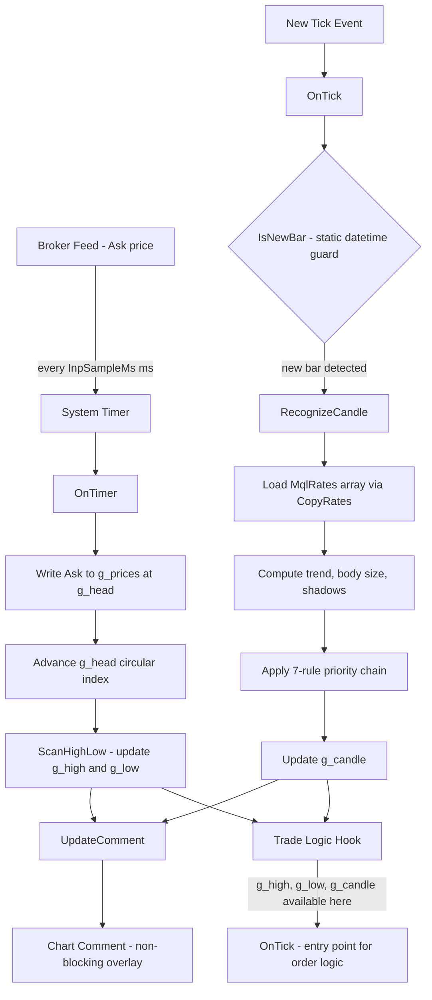
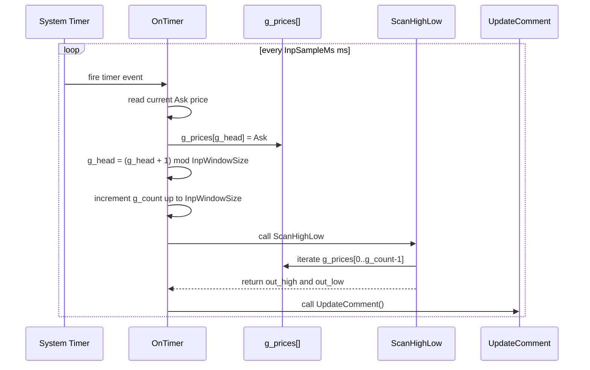
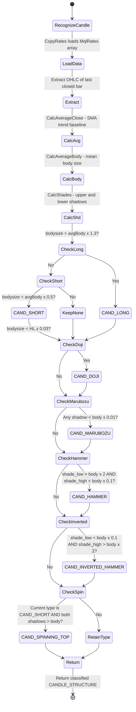
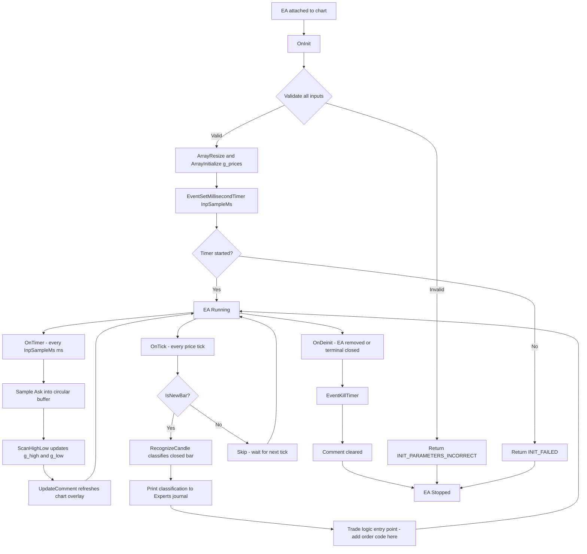
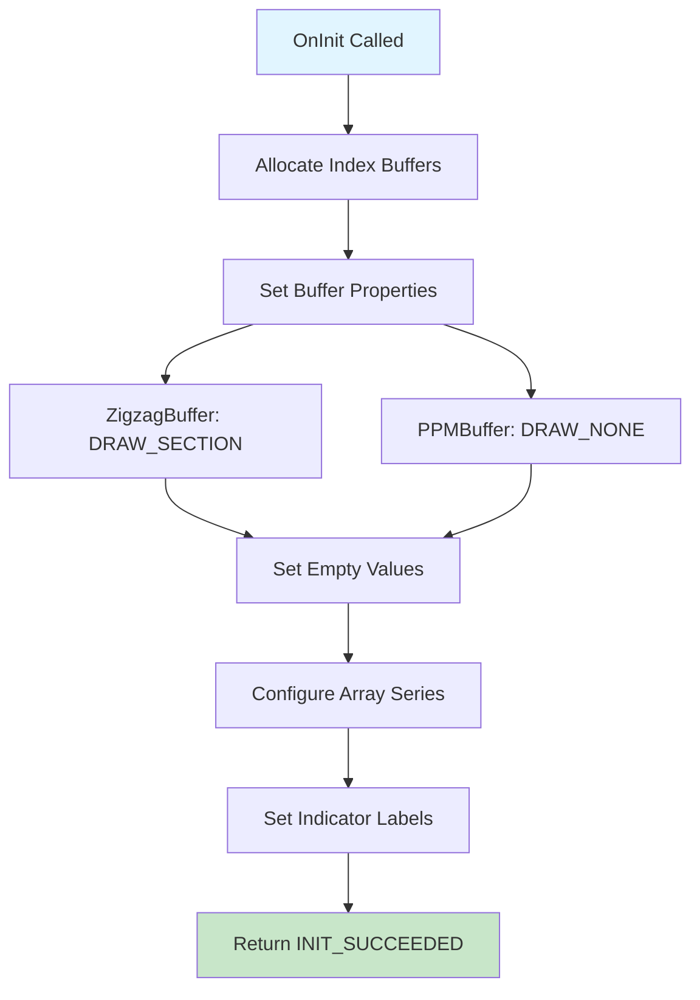
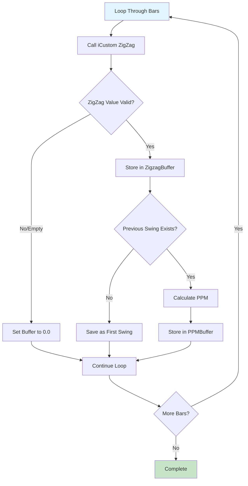
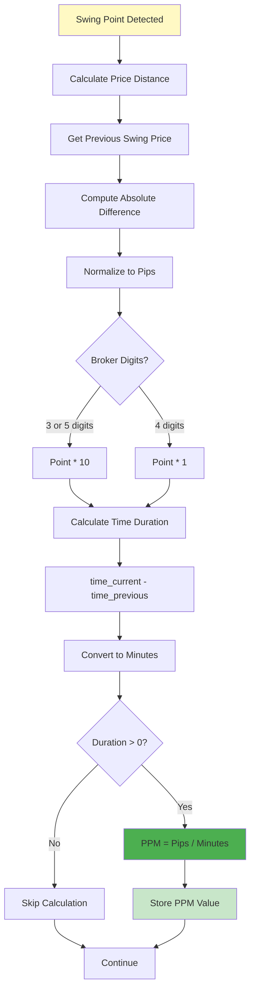
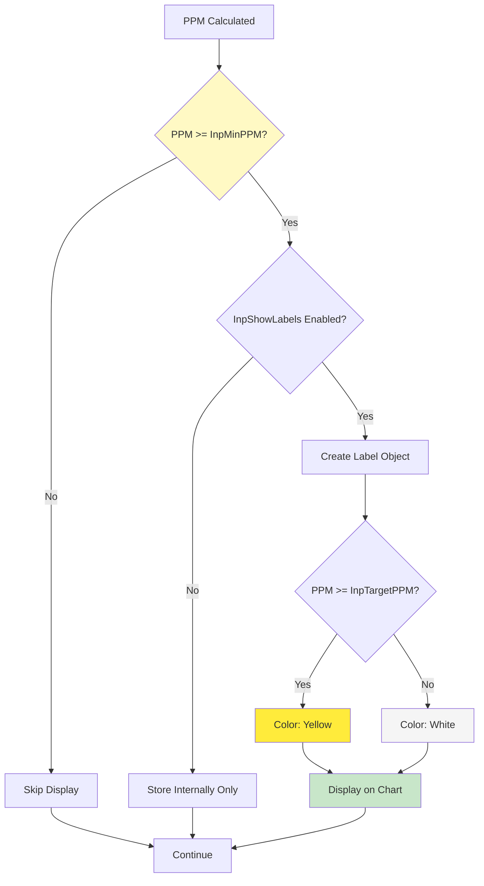
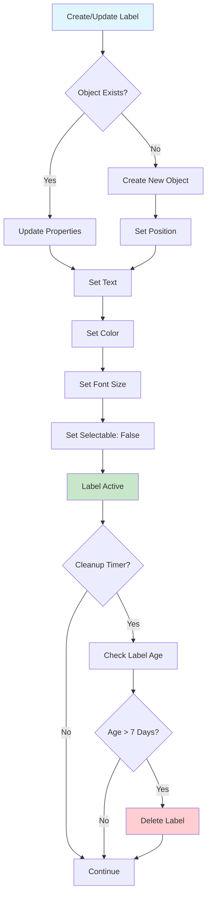
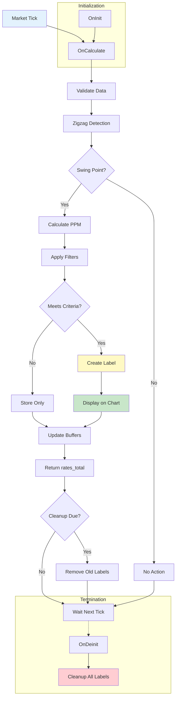

# OneMinuteMan

> **MetaTrader 4 Expert Advisor** — Rolling 1-minute price range scanner with single-bar candlestick pattern recognition engine.

[](https://www.metatrader4.com)
[](https://docs.mql4.com)
[](https://github.com/nhasibuan/oneminuteman)
[](LICENSE)

---

## Table of Contents

- [Product Requirements](#product-requirements)
- [Overview](#overview)
- [Features](#features)
- [Architecture & Blueprint](#architecture--blueprint)
- [Dataflow](#dataflow)
- [Installation](#installation)
- [Input Parameters](#input-parameters)
- [Data Dictionary](#data-dictionary)
- [Candle Classification Rules](#candle-classification-rules)
- [Known Limitations](#known-limitations)

---

## Product Requirements

### PRD — OneMinuteMan EA

#### Problem Statement

Manual traders monitoring short-term price action on MetaTrader 4 have no native, non-blocking tool that simultaneously tracks the intrabar price range (sub-minute resolution) and classifies the most recently closed bar into a named candlestick pattern with trend context. Existing solutions require separate indicators, introduce UI-blocking alert dialogs, or rely on architecturally unsafe infinite loops inside `OnInit()`.

#### Goals

| # | Goal | Success Metric |
|---|---|---|
| G1 | Track rolling 1-minute Ask price range in real time | High and low updated within 50 ms of price change |
| G2 | Classify the last closed bar into a named single-candle pattern | Pattern identified correctly within one tick of bar close |
| G3 | Display both range and pattern data on chart without blocking UI | `Comment()` overlay — zero modal popups |
| G4 | Provide clean, extensible entry point for order logic | `OnTick()` exposes `g_high`, `g_low`, `g_candle` for trade logic |
| G5 | Adhere to MQL4 best practices (event-driven, no `while(1)`) | Compiles with `#property strict`; EA removable cleanly |

#### Non-Goals

- Does **not** place, modify, or close orders (scaffolding only)
- Does **not** implement multi-candle patterns (Engulfing, Harami, Star composites)
- Does **not** support MQL5 / MetaTrader 5 natively (separate port required)
- Does **not** persist data between EA restarts (in-memory only)

#### User Stories

| ID | As a… | I want to… | So that… |
|---|---|---|---|
| US-01 | Scalp trader | See the 1-minute Ask high/low live on chart | I can gauge intrabar volatility at a glance |
| US-02 | Price action trader | Know the candlestick type of the last closed bar | I can confirm or reject a setup without switching tools |
| US-03 | EA developer | Have a clean `OnTick()` entry point with range + pattern data | I can add order logic without restructuring the EA |
| US-04 | MT4 user | Remove the EA without freezing the terminal | The EA lifecycle is correctly managed |

#### Functional Requirements

| ID | Requirement | Priority |
|---|---|---|
| FR-01 | Sample Ask price every `InpSampleMs` ms via `EventSetMillisecondTimer` | Must Have |
| FR-02 | Maintain circular buffer of `InpWindowSize` samples | Must Have |
| FR-03 | Compute true rolling high and low from buffer on every timer tick | Must Have |
| FR-04 | Detect new bar open once per bar via static datetime guard | Must Have |
| FR-05 | Classify last closed bar using 7-rule priority chain | Must Have |
| FR-06 | Display merged range + candle panel via `Comment()` | Must Have |
| FR-07 | Log bar classification to Experts journal via `Print()` | Should Have |
| FR-08 | Validate all inputs in `OnInit()`; return `INIT_PARAMETERS_INCORRECT` on failure | Must Have |
| FR-09 | Kill timer and clear comment on `OnDeinit()` | Must Have |
| FR-10 | Support configurable averaging period for body/trend baseline | Should Have |

#### Non-Functional Requirements

| ID | Requirement |
|---|---|
| NFR-01 | Compiles with `#property strict` — zero warnings |
| NFR-02 | Single `.mq4` file — no external `.mqh` dependencies |
| NFR-03 | Circular buffer write is O(1); no O(n) array shifts |
| NFR-04 | `DBL_MAX` / `-DBL_MAX` sentinels — instrument-agnostic (works on JPY, indices, crypto CFDs) |
| NFR-05 | No `Alert()`, `MessageBox()`, or blocking calls in timer/tick handlers |
| NFR-06 | `EventKillTimer()` always paired with `EventSetMillisecondTimer()` |

---

## Overview

**OneMinuteMan** is a single-file MQL4 Expert Advisor that merges two independent engines:

1. **Range Scanner** — samples Ask every 50 ms into a circular buffer and continuously reports the rolling 1-minute high/low.
2. **Candlestick Recognizer** — on each new bar open, classifies the just-closed bar into one of 9 named single-candle patterns with trend context.

Both engines run concurrently via separate event handlers and expose their results through shared globals ready for trade signal logic.

---

## Features

- Rolling 1-minute high/low with sub-second resolution (configurable down to 10 ms)
- 9-pattern single-bar candlestick engine: Doji, Hammer, Inverted Hammer, Marubozu, Long, Short, Spinning Top, Star (reserved)
- Trend classification per bar: Ascending / Descending / Lateral (SMA-based)
- Circular buffer — O(1) write, no array shifting
- Live dual-panel `Comment()` overlay — range block + candle block
- `OnTick()` entry point with `g_high`, `g_low`, `g_candle` ready for order logic
- Full input validation with `INIT_PARAMETERS_INCORRECT` guard
- MQL4 strict-mode compliant — `(ENUM_TIMEFRAMES)_Period` cast for `EnumToString`

---

## Architecture & Blueprint

```
oneminuteman.mq4 (212 lines)
  │
  ├── [Constants] BUFFER_SIZE = 1202
  ├── [Inputs] InpSampleMs | InpWindowSize | InpAverPeriod
  ├── [Enums] TYPE_CANDLESTICK (8) | TYPE_TREND (4)
  ├── [Struct] CANDLE_STRUCTURE (type + unit + bodysize + shadows + OHLC)
  ├── [Globals] g_prices[] | g_head | g_count | g_high | g_low | g_candle
  │
  ├── Section 1 TFLabel() — safe timeframe string (strict-mode fix)
  ├── Section 2 IsNewBar() — bar-open guard (static datetime)
  ├── Section 3 ScanHighLow() — O(n) range scan with DBL_MAX sentinels
  ├── Section 4 CalcShades() — upper/lower shadow extraction
  │             CalcAverageClose() — SMA for trend baseline
  │             CalcAverageBody() — average body for size classification
  │             RecognizeCandle() — main 7-rule classification function
  ├── Section 5 CandleTypeName() — enum to string
  │             TrendName() — enum to string
  ├── Section 6 UpdateComment() — merged dual-panel chart overlay
  │
  ├── OnInit()    validate → allocate → EventSetMillisecondTimer()
  ├── OnDeinit()  EventKillTimer() → Comment("")
  ├── OnTimer()   sample Ask → write buffer → ScanHighLow → UpdateComment
  └── OnTick()    IsNewBar guard → RecognizeCandle → Print log → trade entry
```

---

## Dataflow

### 1. System Dataflow



### 2. Circular Buffer Write Sequence



### 3. Candle Recognition State Flow



### 4. EA Lifecycle



---

## Installation

1. Copy `oneminuteman.mq4` to your MT4 `MQL4/Experts/` folder.
2. In MetaEditor, open the file and press **F7** to compile. Confirm zero errors and zero warnings.
3. In MetaTrader 4, open a chart (any symbol / timeframe).
4. Drag the EA from the Navigator panel onto the chart.
5. In the EA properties dialog, set `InpSampleMs`, `InpWindowSize`, `InpAverPeriod` as needed and enable **Allow live trading**.
6. Click **OK**. The dual-panel `Comment()` overlay appears on the chart within the first timer tick.

> **Tip for XAU/USD scalping:** Use default settings (`InpSampleMs=50`, `InpWindowSize=1200`, `InpAverPeriod=10`) on M1 for the most responsive 1-minute range. For H1 candle pattern context, attach a second instance with `InpAverPeriod=20` on an H1 chart.

---

## Input Parameters

| Parameter | Default | Range | Description |
|---|---|---|---|
| `InpSampleMs` | `50` | ≥ 10 | Timer interval in milliseconds. `50 ms × 1200 = 60 s` rolling window at defaults. |
| `InpWindowSize` | `1200` | 60 – 20000 | Circular buffer size (sample count). Window duration = `InpWindowSize × InpSampleMs` ms. |
| `InpAverPeriod` | `14` | 1 – 500 | Bars used to compute average body size and SMA close for trend direction. |

---

## Data Dictionary

### Enumerations

#### `TYPE_CANDLESTICK`

| Value | Description | Detection Condition |
|---|---|---|
| `CAND_UNKNOWN` | Unclassified | Default — no rule matched |
| `CAND_DOJI` | Doji | `bodysize < HL × 0.03` |
| `CAND_SHORT` | Short body | `bodysize < avgBody × 0.5` |
| `CAND_LONG` | Long body | `bodysize > avgBody × 1.3` |
| `CAND_MARUBOZU` | Marubozu | Either shadow `< body × 0.01` |
| `CAND_HAMMER` | Hammer | `shade_low > body×2` AND `shade_high < body×0.1` |
| `CAND_INVERTED_HAMMER` | Inverted Hammer | `shade_low < body×0.1` AND `shade_high > body×2` |
| `CAND_SPINNING_TOP` | Spinning Top | `CAND_SHORT` + both shadows `> body` |

#### `TYPE_TREND`

| Value | Condition |
|---|---|
| `TREND_UNKNOWN` | Default |
| `TREND_UPPER` | `close > avg_close` |
| `TREND_DOWN` | `close < avg_close` |
| `TREND_LATERAL` | `close == avg_close` |

### `CANDLE_STRUCTURE` Fields

| Field | Type | Description |
|---|---|---|
| `type` | `TYPE_CANDLESTICK` | Classified pattern after full priority chain |
| `unit` | `TYPE_TREND` | Trend direction vs `InpAverPeriod` SMA |
| `bodysize` | `double` | `MathAbs(open - close)` in price units |
| `shade_high` | `double` | Upper shadow length |
| `shade_low` | `double` | Lower shadow length |
| `avg_close` | `double` | SMA close over `InpAverPeriod` |
| `avg_body` | `double` | Mean body size over `InpAverPeriod` |
| `open` | `double` | Bar open price |
| `high` | `double` | Bar high price |
| `low` | `double` | Bar low price |
| `close` | `double` | Bar close price |

### Global State Variables

| Variable | Type | Description |
|---|---|---|
| `g_prices[]` | `double[]` | Circular buffer — `InpWindowSize` Ask samples |
| `g_head` | `int` | Next-write index; wraps at `InpWindowSize` |
| `g_count` | `int` | Valid sample count — capped at `InpWindowSize` |
| `g_high` | `double` | Current rolling high |
| `g_low` | `double` | Current rolling low |
| `g_candle` | `CANDLE_STRUCTURE` | Last classified bar pattern |

### Functions

| Function | Returns | Description |
|---|---|---|
| `TFLabel()` | `string` | Clean TF label (`M1`, `H4`) — casts `_Period` to `ENUM_TIMEFRAMES` |
| `IsNewBar()` | `bool` | `true` once per bar open — static datetime guard |
| `ScanHighLow()` | `void` | Full buffer scan; `DBL_MAX` sentinels |
| `CalcAverageClose(...)` | `double` | SMA close over period |
| `CalcAverageBody(...)` | `double` | Mean body size over period |
| `CalcShades(...)` | `void` | Upper/lower shadow calc for bull and bear bars |
| `RecognizeCandle(...)` | `bool` | Full candle classification — `false` if data insufficient |
| `CandleTypeName(...)` | `string` | `TYPE_CANDLESTICK` → human label |
| `TrendName(...)` | `string` | `TYPE_TREND` → human label |
| `UpdateComment()` | `void` | Merged dual-panel `Comment()` overlay |

---

## Candle Classification Rules

Rules are applied in priority order — later rules override earlier ones:

| Priority | Pattern | Condition |
|---|---|---|
| 1 | `CAND_LONG` | `bodysize > avgBody × 1.3` |
| 2 | `CAND_SHORT` | `bodysize < avgBody × 0.5` |
| 3 | `CAND_DOJI` | `HL > 0` AND `bodysize < HL × 0.03` |
| 4 | `CAND_MARUBOZU` | `bodysize > 0` AND (lower OR upper shadow `< body × 0.01`) |
| 5 | `CAND_HAMMER` | `shade_low > body × 2` AND `shade_high < body × 0.1` |
| 6 | `CAND_INVERTED_HAMMER` | `shade_low < body × 0.1` AND `shade_high > body × 2` |
| 7 | `CAND_SPINNING_TOP` | current type == `CAND_SHORT` AND both shadows `> body` |

---

## Known Limitations

| # | Limitation | Notes |
|---|---|---|
| 1 | Single-bar patterns only | Multi-candle composites (Engulfing, Harami, Star) require additional lookback in `OnTick()` |
| 2 | SMA trend — not directional | Equal close prices → `TREND_LATERAL` regardless of bar direction |
| 3 | In-memory only | Buffer resets on EA restart or terminal close |
| 4 | Timer drift under load | `EventSetMillisecondTimer` is best-effort — intervals may drift under high CPU |
| 5 | Ask-only sampling | Replace `Ask` with `Bid` in `OnTimer()` for bid-based instruments |
| 6 | No multi-threading | Single-threaded — heavy computation in `OnTick()` can delay timer callbacks |

---

## References

- [MQL4 Reference — EventSetMillisecondTimer](https://docs.mql4.com/eventfunctions/eventsetmillisecondtimer)
- [MQL4 Reference — CopyRates](https://docs.mql4.com/series/copyrates)
- [MQL5 Article — Analyzing Candlestick Patterns](https://www.mql5.com/en/articles/101)
- [MQL4 Reference — ENUM_TIMEFRAMES](https://docs.mql4.com/constants/chartconstants/enum_timeframes)


---

## PPM Efficiency Indicator

### Overview

The **Pip Per Minute (PPM) Efficiency Indicator** is a supplementary tool designed to measure market movement efficiency by calculating the ratio of price distance (in pips) to time duration (in minutes). This indicator helps identify high-quality scalping opportunities by filtering for movements that achieve optimal efficiency thresholds.

**Core Formula:**
```
PPM = Distance (pips) / Duration (minutes)
```

**Strategic Objectives:**
- Filter for high-efficiency movements (≥1.5 PPM minimum, ≥2.0 PPM optimal)
- Minimize time-based price risk through short exposure periods (30 seconds to 2.5 minutes)
- Identify 100-150 quality trading opportunities per day from approximately 600 total market movements
- Utilize M1 timeframe with Zigzag indicator (2-2-1 configuration) for precise swing detection

### Key Features

1. **Efficiency-Based Filtering** - Quantifies trade quality through mathematical precision
2. **Time Risk Management** - Short exposure reduces directional market risk
3. **Visual Feedback** - Real-time PPM values displayed directly on chart
4. **Configurable Parameters** - Input-driven design allows threshold customization
5. **Broker-Agnostic** - Automatically adjusts for 3/4/5-digit broker configurations
6. **Resource Optimized** - Automatic cleanup of old labels and memory management

---

## Detailed Dataflow Descriptions

### 1. Initialization Dataflow

**Description:** The indicator initialization phase establishes buffer structures, configures visual properties, and prepares the calculation engine.



**Key Operations:**
- Buffer 0 (ZigzagBuffer): Visual representation of swing points
- Buffer 1 (PPMBuffer): Stores calculated PPM values for each swing
- Empty value set to 0.0 to distinguish valid data from uninitialized bars
- Array series configuration ensures proper indexing (newest bar = index 0)

---

### 2. Price Data Acquisition Dataflow

**Description:** On each tick, the indicator receives time-series data from the MT4 platform and prepares arrays for processing.

```mermaid
graph LR
    A[OnCalculate Triggered] --> B{Sufficient Bars?}
    B -->|No| C[Return 0]
    B -->|Yes| D[Set Arrays as Series]
    D --> E[time[] array]
    D --> F[high[] array]
    D --> G[low[] array]
    E --> H[Validate Data]
    F --> H
    G --> H
    H --> I[Proceed to Zigzag]
    
    style A fill:#fff9c4
    style I fill:#c8e6c9
    style C fill:#ffcdd2
```

**Validation Checks:**
- Minimum bars: `InpDepth + InpBackstep` required for Zigzag calculation
- Array series flag ensures consistent indexing across all time series
- Data integrity verification before proceeding to calculations

---

### 3. Zigzag Calculation Dataflow

**Description:** Utilizes MT4's built-in Zigzag indicator to identify swing high and swing low points in the market.



**Zigzag Parameters:**
- **Depth (2):** Minimum number of bars for high/low reversal detection
- **Deviation (2):** Minimum price change (in points) required for new swing
- **Backstep (1):** Bars to skip after detecting a swing to avoid false signals

---

### 4. PPM Calculation Dataflow

**Description:** Measures efficiency by computing the pip-per-minute ratio between consecutive swing points.



**Calculation Formula:**
```mql4
double pips = NormalizePips(priceDist);
int minutes = (int)((time[prevBar] - time[currentBar]) / 60);
if (minutes > 0) {
    ppm = pips / minutes;
}
```

---

### 5. Efficiency Filtering Dataflow

**Description:** Applies threshold filters to identify and display only high-efficiency trading opportunities.



**Threshold Levels:**
- **1.5 PPM:** Minimum entry requirement (~150 opportunities/day)
- **2.0 PPM:** Optimal efficiency target (~100 opportunities/day)
- Color coding provides instant visual identification of trade quality

---

### 6. Label Management Dataflow

**Description:** Manages chart objects to display PPM values while preventing memory leaks and visual clutter.



**Resource Management:**
- Hourly cleanup cycle removes labels older than 7 days from visible range
- Object name convention: `PPM_[timestamp]` for unique identification
- `OnDeinit()` ensures complete cleanup when indicator is removed

---

### 7. Complete System Dataflow

**Description:** End-to-end flow showing how data moves through the entire PPM indicator system.



---

## User Guide

### Installation

#### Step 1: Download the Indicator
1. Navigate to the repository: `https://github.com/nhasibuan/oneminuteman`
2. Download `PPMEfficiency.mq4` file
3. Save to your computer

#### Step 2: Install in MetaTrader 4
1. Open MT4 platform
2. Click **File** → **Open Data Folder**
3. Navigate to `MQL4` → `Indicators`
4. Copy `PPMEfficiency.mq4` into this folder
5. Restart MT4 or right-click Navigator panel → **Refresh**

#### Step 3: Verify Installation
1. Open Navigator panel (Ctrl+N)
2. Expand **Indicators** → **Custom**
3. Locate **PPMEfficiency** in the list

---

### Configuration

#### Adding to Chart
1. Open an M1 (1-minute) chart for your preferred symbol (e.g., EURUSD, XAUUSD)
2. Drag **PPMEfficiency** from Navigator to the chart
3. Configuration dialog will appear

#### Parameter Settings

**Zigzag Configuration:**
```
InpDepth      = 2   // Minimum bars for reversal detection
InpDeviation  = 2   // Minimum price change in points
InpBackstep   = 1   // Bars to skip after swing detection
```

**PPM Thresholds:**
```
InpMinPPM     = 1.5   // Minimum efficiency for display (1.5 = ~150 opportunities/day)
InpTargetPPM  = 2.0   // Target efficiency for highlighting (2.0 = ~100 opportunities/day)
```

**Visual Settings:**
```
InpShowLabels    = true        // Display PPM values on chart
InpLowPPMColor   = clrWhite    // Color for 1.5-2.0 PPM range
InpHighPPMColor  = clrYellow   // Color for >=2.0 PPM (optimal)
```

#### Recommended Configurations

**Conservative (More Opportunities):**
- InpMinPPM = 1.5
- InpTargetPPM = 2.0
- Expect: 150 signals per day

**Aggressive (Higher Quality):**
- InpMinPPM = 2.0
- InpTargetPPM = 2.5
- Expect: 100 signals per day

**Ultra-Selective (Premium Only):**
- InpMinPPM = 2.5
- InpTargetPPM = 3.0
- Expect: 50-70 signals per day

---

### Usage Instructions

#### 1. Chart Setup
- **Timeframe:** M1 (1-minute) - CRITICAL requirement
- **Symbol:** Any forex pair or instrument (EURUSD, GBPUSD, XAUUSD recommended)
- **Chart Type:** Candlestick recommended for visual confirmation

#### 2. Interpreting Signals

**Visual Elements:**
- **Red Zigzag Lines:** Connect swing high and swing low points
- **White Numbers:** PPM values between 1.5-2.0 (acceptable efficiency)
- **Yellow Numbers:** PPM values ≥2.0 (optimal efficiency - priority targets)

**Signal Quality Assessment:**
```
PPM < 1.5  : Low efficiency - AVOID
PPM 1.5-2.0: Acceptable - Consider with confirmation
PPM ≥ 2.0  : High efficiency - PRIORITY targets
PPM ≥ 3.0  : Exceptional - Rare premium opportunities
```

#### 3. Entry Strategy

When a new swing point is detected with qualifying PPM:

**Step 1: Validate Efficiency**
- Check PPM value is ≥ InpMinPPM threshold
- Yellow labels indicate optimal targets

**Step 2: Confirm Direction**
- Swing high with high PPM = potential SHORT entry
- Swing low with high PPM = potential LONG entry

**Step 3: Time Management**
- Target duration: 30 seconds to 2.5 minutes
- Exit if efficiency drops (PPM falls below threshold)
- Use OneMinuteMan EA for execution and pattern confirmation

#### 4. Risk Management

**Position Sizing:**
- Keep lot sizes small for M1 scalping
- Maximum 1-2% account risk per trade
- Consider spread costs in profit calculations

**Stop Loss Guidelines:**
- Place stop beyond the previous swing point
- Typical range: 5-10 pips for major pairs
- Adjust for symbol volatility (XAUUSD may require wider stops)

**Take Profit Targets:**
- Conservative: 3-5 pips
- Moderate: 5-8 pips
- Aggressive: 8-12 pips
- Always consider PPM value - higher PPM allows tighter targets

---

### Troubleshooting

#### Issue: No PPM Labels Displayed

**Solutions:**
1. Verify `InpShowLabels = true`
2. Check that chart is M1 timeframe
3. Lower `InpMinPPM` threshold to see more signals
4. Ensure sufficient historical data loaded (minimum 500 bars)

#### Issue: Too Many Labels (Chart Clutter)

**Solutions:**
1. Increase `InpMinPPM` threshold (try 2.0 or higher)
2. Set `InpShowLabels = false` to hide labels
3. Zoom out chart to see fewer bars
4. Wait for automatic cleanup cycle (runs hourly)

#### Issue: Indicator Not Calculating

**Solutions:**
1. Check for compilation errors: Open MetaEditor → Compile `PPMEfficiency.mq4`
2. Verify `#property strict` is enabled
3. Ensure standard Zigzag indicator is available in MT4
4. Check Journal tab for error messages

#### Issue: PPM Values Seem Incorrect

**Solutions:**
1. Verify broker digit configuration (3/4/5 digits)
2. Check Zigzag parameters match source specification (2-2-1)
3. Ensure time array is properly set as series
4. Validate that sufficient bars are available for calculation

---

### Best Practices

#### Optimal Trading Conditions
- **Time Sessions:** London/NY overlap (12:00-16:00 GMT) for highest liquidity
- **Avoid:** Major news releases (NFP, FOMC, GDP) - volatility skews PPM
- **Spread Awareness:** Trade during low-spread hours to maximize profit potential

#### Combining with OneMinuteMan EA
The PPM Efficiency Indicator complements the OneMinuteMan EA:

1. **PPM Indicator:** Identifies high-efficiency swing points
2. **OneMinuteMan EA:** Validates candlestick patterns and executes trades
3. **Combined Strategy:** Only trade OneMinuteMan signals that occur at high PPM swing points

#### Performance Monitoring
- Log PPM values daily to establish symbol-specific norms
- Track win rate by PPM threshold (1.5-2.0 vs ≥2.0)
- Adjust `InpMinPPM` based on 30-day statistical analysis
- Monitor execution speed - slippage can negate PPM advantages

#### Broker Compatibility
- Verify broker allows M1 scalping without restrictions
- Test with demo account for minimum 2 weeks
- Confirm execution quality meets PPM time requirements
- Check that broker spread remains stable during trading hours

---

### Advanced Usage

#### Multi-Symbol Monitoring
1. Open multiple M1 charts (EURUSD, GBPUSD, USDJPY, XAUUSD)
2. Apply PPMEfficiency to each chart with same settings
3. Focus on symbols showing highest PPM values (yellow labels)
4. Trade the most efficient opportunities across all symbols

#### Alert Integration (Future Enhancement)
For developers wanting to add alerts:

```mql4
if(ppm >= InpTargetPPM) {
    string alertMsg = "High PPM Detected: " + DoubleToStr(ppm, 2) + 
                      " on " + Symbol() + " M1";
    Alert(alertMsg);
    SendNotification(alertMsg);  // Mobile notification
}
```

#### Export PPM Data for Analysis
PPM values stored in `PPMBuffer[]` can be accessed by:
- Custom Expert Advisors via `iCustom()` function
- Exported to CSV for statistical analysis
- Used in machine learning models for pattern recognition

---

### Frequently Asked Questions

**Q: Can I use PPM Indicator on M5 or H1 charts?**
A: Not recommended. The PPM strategy is specifically designed for M1 charts. Higher timeframes dilute the PPM values, making it impossible to achieve the 2.0 target due to increased time duration.

**Q: How many trades should I expect per day?**
A: Approximately 100-150 opportunities with InpMinPPM = 1.5, and 50-100 with InpMinPPM = 2.0. Actual count varies by symbol volatility and market conditions.

**Q: Does PPM Indicator generate trade signals?**
A: No, it's an analytical tool that measures efficiency. It identifies high-quality swing points but does not generate entry/exit signals. Use with OneMinuteMan EA for complete strategy.

**Q: What's the difference between white and yellow labels?**
A: White labels show PPM between 1.5-2.0 (acceptable efficiency), yellow labels show PPM ≥2.0 (optimal efficiency - priority targets).

**Q: Why are old labels disappearing?**
A: Automatic cleanup runs hourly to prevent memory leaks and chart clutter. Labels older than 7 days from the visible chart area are removed.

**Q: Can I backtest with PPM values?**
A: Yes. PPM values are stored in the indicator buffer and can be accessed by Expert Advisors using `iCustom()` function for historical analysis.

---

### Support and Resources

**Repository:** https://github.com/nhasibuan/oneminuteman

**Issues/Questions:** Submit via GitHub Issues tab

**Documentation:** This README and inline code comments

**License:** MIT License - free for personal and commercial use

---

### Version History

**v5.00** (Current)
- Initial PPM Efficiency Indicator implementation
- Integrated with OneMinuteMan EA repository
- Full dataflow documentation and user guide
- Broker-agnostic pip normalization
- Automatic label cleanup and memory management

---

### Credits

**Developer:** Norman Hasibuan (nhasibuan)

**Strategy Concept:** Bionics Trading Algorithms - Pip Per Minute (PPM) methodology

**References:**
- MQL4 Documentation: https://docs.mql4.com/
- Zigzag Indicator Analysis: https://www.mql5.com/en/articles/101
- PPM Trading Theory: NotebookLM Source Analysis

---

## License

MIT License - See LICENSE file for details
