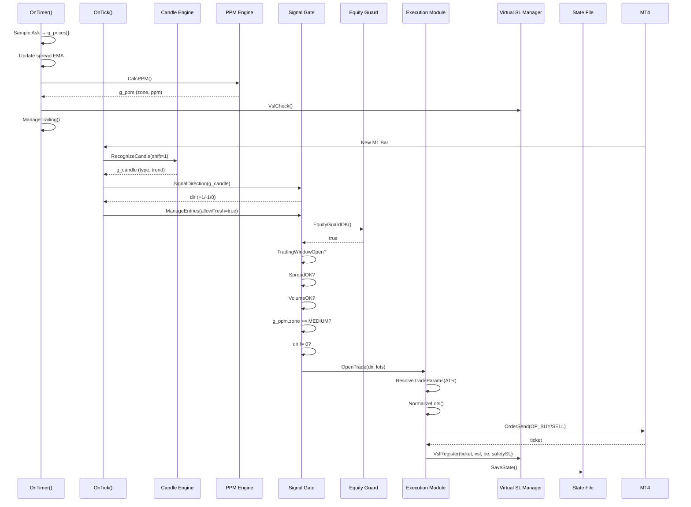
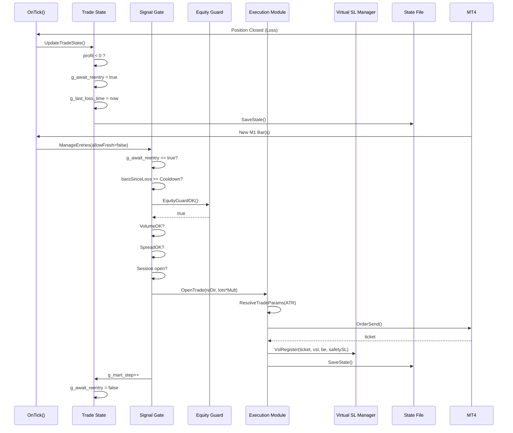
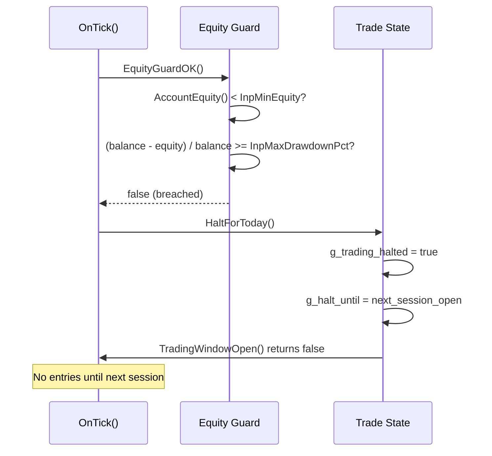

# OneMinuteMan

A MetaTrader 4 Expert Advisor (MQL4) that forces all analysis onto the **M1 (1-minute)** timeframe. It combines a tick-sampled range scanner, a candlestick recognizer, a **PPM (Pips-Per-Minute) efficiency engine**, a tick-volume spike filter, **ATR-dynamic** virtual (hidden) stop losses / take-profit / trailing, **adaptive slippage & max-spread** (from rolling averages, any symbol), **break-even locking**, **equity protection guards**, **martingale cooldown**, and **persistent state recovery**.

> **High-risk software.** This EA uses martingale position sizing and broker-hidden (virtual) stop losses, and re-entries after a loss. These dramatically increase blow-up risk. Use on a demo account first. Nothing here is financial advice.

---

## Table of Contents

- [Product Requirements Document](#product-requirements-document)
- [Architecture Blueprint](#architecture-blueprint)
- [Data Flow Diagram](#data-flow-diagram)
- [UML Sequence Diagram](#uml-sequence-diagram)
- [How It Works](#how-it-works)
- [Signal Logic](#signal-logic)
- [Martingale Modes](#martingale-modes)
- [Dynamic Risk (ATR)](#dynamic-risk-atr)
- [Break-Even & Safety Net](#break-even--safety-net)
- [Equity Protection](#equity-protection)
- [Adaptive Execution](#adaptive-execution)
- [State Persistence](#state-persistence)
- [Installation](#installation)
- [Inputs](#inputs)
- [Risk Warnings](#risk-warnings)
- [Changelog](#changelog)

---

## Product Requirements Document

### PRD-001 — Overview
| Field | Value |
|---|---|
| **Product Name** | OneMinuteMan |
| **Version** | 9.10 |
| **Platform** | MetaTrader 4 (MQL4) |
| **Timeframe** | M1 (forced) |
| **Strategy Type** | Scalping + Martingale Recovery |
| **Risk Level** | High |

### PRD-002 — Functional Requirements

| ID | Requirement | Priority | Status |
|---|---|---|---|
| FR-001 | Sample tick data into a rolling circular buffer every N milliseconds | P0 | Implemented |
| FR-002 | Compute rolling High/Low range from tick samples | P0 | Implemented |
| FR-003 | Recognize 10 candlestick patterns on the last closed M1 bar | P0 | Implemented |
| FR-004 | Determine trend direction against SMA | P0 | Implemented |
| FR-005 | Calculate PPM (Pips-Per-Minute) via ZigZag pivot analysis | P0 | Implemented |
| FR-006 | Gate entries with tick-volume spike filter | P0 | Implemented |
| FR-007 | ATR-dynamic SL, TP, and trailing stop distances | P0 | Implemented |
| FR-008 | Virtual (hidden) stop-loss with broker-side safety SL | P0 | Implemented |
| FR-009 | Break-even trigger with configurable lock pips | P0 | Implemented |
| FR-010 | Adaptive max-spread and slippage from rolling EMA | P0 | Implemented |
| FR-011 | Martingale re-entry (SAME or REVERSE direction) | P0 | Implemented |
| FR-012 | Martingale cooldown bars between steps | P0 | Implemented |
| FR-013 | Session-based trading window with daily halt | P0 | Implemented |
| FR-014 | Equity drawdown guard — halt at max daily drawdown % | P0 | Implemented |
| FR-015 | Minimum equity floor guard | P0 | Implemented |
| FR-016 | Persistent state save/load across EA restarts | P0 | Implemented |
| FR-017 | Real-time on-chart info panel | P1 | Implemented |
| FR-018 | Input validation with error codes on init | P1 | Implemented |

### PRD-003 — Non-Functional Requirements

| ID | Requirement | Target |
|---|---|---|
| NFR-001 | Timer tick latency | < 50ms |
| NFR-002 | Virtual SL enforcement latency | < 50ms |
| NFR-003 | Memory footprint | < 10MB |
| NFR-004 | Symbol agnostic (no hardcoded pairs) | 100% |
| NFR-005 | Graceful degradation on missing ZigZag | Fail on init |
| NFR-006 | State recovery time | < 100ms |

### PRD-004 — Signal Entry Conditions (ALL must be true)
1. Trading enabled (`InpEnableTrading = true`)
2. No open position on the symbol
3. Inside session hours
4. Spread within adaptive limit
5. PPM zone is MEDIUM or HIGH
6. Tick volume >= multiplier x average
7. Candle produces a directional signal
8. Equity guard passes (drawdown + minimum equity)

### PRD-005 — Martingale Re-Entry Conditions (ALL must be true)
1. Previous trade was a loss
2. Martingale step < max steps
3. Martingale cooldown bars elapsed
4. Volume filter passes
5. Equity guard passes
6. Session is open
7. Spread is acceptable

---

## Architecture Blueprint

```
┌─────────────────────────────────────────────────────────────────────────┐
│                         OneMinuteMan v9.10                              │
│                     M1 Forced Scalping Architecture                     │
├─────────────────────────────────────────────────────────────────────────┤
│  EVENT LAYER                    │  STATE LAYER                          │
│  ───────────                    │  ──────────                           │
│  OnInit()    → Validate inputs  │  g_prices[]      — Tick buffer        │
│              → Load state       │  g_candle        — Last bar struct    │
│              → Start timer      │  g_ppm           — PPM result         │
│              → Verify ZigZag    │  g_vsl[]         — Virtual SL entries │
│  OnDeinit()  → Save state       │  g_spread_ema    — Rolling spread     │
│              → Kill timer       │  g_mart_step     — Martingale counter │
│  OnTimer()   → Sample ticks     │  g_await_reentry — Re-entry flag      │
│              → Update range     │  g_trading_halted— Daily halt flag    │
│              → Compute PPM      │  g_day_start_balance— DD baseline     │
│              → Trail / VSL      │                                       │
│  OnTick()    → Detect new bar   │                                       │
│              → Recognize candle │                                       │
│              → Update state     │                                       │
│              → Manage entries   │                                       │
├─────────────────────────────────────────────────────────────────────────┤
│  ENGINE LAYER                                                           │
│  ────────────                                                           │
│                                                                           │
│   ┌──────────────┐    ┌──────────────┐    ┌──────────────┐               │
│   │ Range Scanner│    │Candle Engine │    │  PPM Engine  │               │
│   │──────────────│    │──────────────│    │──────────────│               │
│   │ Circular buf │    │ Pattern recog│    │ ZigZag scan  │               │
│   │ Rolling H/L  │    │ Trend (SMA)  │    │ Pips/minute  │               │
│   └──────┬───────┘    └──────┬───────┘    └──────┬───────┘               │
│          │                   │                   │                        │
│          └───────────────────┼───────────────────┘                        │
│                              ▼                                            │
│   ┌──────────────────────────────────────────────────────┐               │
│   │              SIGNAL GATE (ALL must pass)              │               │
│   │  PPM zone >= MEDIUM + Volume OK + Candle signal +    │               │
│   │  Session open + Spread OK + Equity guard OK          │               │
│   └──────────────────────────┬───────────────────────────┘               │
│                              ▼                                            │
│   ┌──────────────────────────────────────────────────────┐               │
│   │              EXECUTION MODULE                         │               │
│   │  ATR-dynamic SL/TP · Virtual SL · Safety SL · BE     │               │
│   │  Trailing stop · Adaptive slippage/spread            │               │
│   └──────────────────────────┬───────────────────────────┘               │
│                              ▼                                            │
│   ┌──────────────────────────────────────────────────────┐               │
│   │              MARTINGALE CONTROLLER                    │               │
│   │  SAME / REVERSE mode · Cooldown bars · Step limit    │               │
│   │  State persistence · Daily halt after max steps      │               │
│   └──────────────────────────┬───────────────────────────┘               │
│                              ▼                                            │
│   ┌──────────────────────────────────────────────────────┐               │
│   │              EQUITY PROTECTION LAYER                  │               │
│   │  Max drawdown % · Min equity floor · Daily reset     │               │
│   └──────────────────────────────────────────────────────┘               │
│                                                                           │
└─────────────────────────────────────────────────────────────────────────┘
```

### Component Responsibilities

| Component | Responsibility | Key Functions |
|---|---|---|
| **Range Scanner** | Maintain rolling tick window and compute H/L | `ScanHighLow()` |
| **Candle Engine** | Classify candlestick patterns and trend | `RecognizeCandle()`, `SignalDirection()` |
| **PPM Engine** | Measure market efficiency via ZigZag pivots | `CalcPPM()` |
| **Volume Filter** | Gate entries on tick-volume spikes | `VolumeOK()` |
| **Execution Module** | Order sending with dynamic risk params | `OpenTrade()`, `ResolveTradeParams()` |
| **Virtual SL Manager** | Hidden SL tracking + broker safety net | `VslRegister()`, `VslCheck()` |
| **Trailing Manager** | ATR-dynamic trailing + break-even | `ManageTrailing()` |
| **Martingale Controller** | Loss recovery with cooldown and limits | `ManageEntries()`, `ResolveMartingaleDir()` |
| **Equity Guard** | Daily drawdown and minimum equity protection | `EquityGuardOK()`, `HaltForToday()` |
| **State Persistence** | Save/restore martingale state to disk | `SaveState()`, `LoadState()` |

---

## Data Flow Diagram

```mermaid
graph TD
    subgraph "External Inputs"
        TICK[Tick Feed<br/>Ask/Bid/Volume]
        MT4[MT4 Server<br/>Rates/History]
        DISK[Disk State File]
    end

    subgraph "OnTimer Loop (50ms)"
        T1[Sample Ask → g_prices[]]
        T2[Update spread EMA]
        T3[ScanHighLow → g_high/g_low]
        T4[CalcPPM → g_ppm]
        T5[ManageTrailing]
        T6[VslCheck → Close if hit]
        T7[UpdateComment]
    end

    subgraph "OnTick Loop (New M1 Bar)"
        K1[RecognizeCandle → g_candle]
        K2[UpdateTradeState]
        K3[ManageEntries]
    end

    subgraph "Entry Decision"
        E1{EquityGuardOK?}
        E2{TradingWindowOpen?}
        E3{SpreadOK?}
        E4{VolumeOK?}
        E5{PPM >= MEDIUM?}
        E6{Candle Signal?}
        E7{Cooldown met?}
    end

    subgraph "Order Output"
        O1[OrderSend → Broker]
        O2[VslRegister → g_vsl[]]
        O3[SaveState → DISK]
    end

    TICK --> T1
    TICK --> T2
    T1 --> T3
    T3 --> T4
    T4 --> T5
    T5 --> T6
    T6 --> T7

    MT4 --> K1
    K1 --> K2
    K2 --> K3

    K3 --> E1
    E1 -->|Yes| E2
    E1 -->|No| T7
    E2 -->|Yes| E3
    E2 -->|No| T7
    E3 -->|Yes| E4
    E3 -->|No| T7
    E4 -->|Yes| E5
    E4 -->|No| T7
    E5 -->|Yes| E6
    E5 -->|No| T7
    E6 -->|Yes| E7
    E6 -->|No| T7
    E7 -->|Yes| O1
    E7 -->|No| T7

    O1 --> O2
    O2 --> O3
    DISK -->|LoadState| K3
```

---

## UML Sequence Diagram

### Fresh Entry Sequence



### Martingale Re-Entry Sequence



### Equity Protection Trigger Sequence



---

## How It Works

Two event handlers drive the EA:

- **`OnTimer()`** (every `InpSampleMs`, default 50 ms): samples Ask into a circular buffer, updates the rolling average spread (`g_spread_ema`), recomputes the range and PPM, manages trailing stops, enforces the virtual SL, and refreshes the on-chart panel.
- **`OnTick()`** (each new M1 bar): recognizes the closed candle, updates cycle state (detecting closed positions and arming martingale if needed), and evaluates entries.

### Engines

| Engine | Purpose |
|---|---|
| Range Scanner | ~60 s rolling high/low from tick samples (informational panel). |
| Candle Recognizer | Classifies the last closed M1 candle + trend vs. SMA. |
| PPM Engine | Efficiency = pip distance of last ZigZag(2-2-1) leg / M1 candles elapsed. |
| Trade Module | Orders, ATR-dynamic virtual SL/TP/trailing, volume filter, adaptive execution, session gating, martingale, equity guards, break-even, safety SL. |

---

## Signal Logic

A fresh trade opens only when **all** conditions hold:

1. `InpEnableTrading = true`
2. No open position on the symbol
3. Inside session hours
4. Spread within the adaptive limit
5. Equity guard passes (min equity + drawdown check)
6. PPM zone is MEDIUM or HIGH
7. Tick volume >= `InpVolMultiplier` x average
8. The candle produces a directional signal

### Candle Signals

| Pattern | Direction | Condition |
|---|---|---|
| Hammer | LONG | Bullish reversal signal |
| Dragonfly Doji | LONG | Bullish reversal signal |
| Inverted Hammer | SHORT | Bearish reversal signal |
| Gravestone Doji | SHORT | Bearish reversal signal |
| Long / Marubozu + Ascending | LONG | Trend continuation |
| Long / Marubozu + Descending | SHORT | Trend continuation |

---

## Martingale Modes

After a losing trade the EA enters a cooldown period (`InpMartCooldownBars`), then re-enters as soon as the volume filter passes. It re-enters with `InpMartMult` x the previous lot size. The re-entry direction is controlled by **`InpMartMode`**:

| Mode | Value | Behavior |
|---|---|---|
| `MART_SAME_DIRECTION` | 0 | Classic martingale — re-enter the **same** direction as the losing trade (average down). |
| `MART_REVERSE_DIRECTION` | 1 | **Reverse** martingale — re-enter the **opposite** direction. Because the tracked direction flips each step, consecutive re-entries alternate. |

Both modes stop after `InpMartMaxSteps` and then halt trading until the next session open.

### Martingale Cooldown
`InpMartCooldownBars` (default 2) enforces a minimum number of M1 bars between martingale steps, reducing the risk of rapid-fire entries during choppy conditions.

---

## Dynamic Risk (ATR)

Stop loss, take profit, and trailing values are derived from the recent **M1 ATR** so they adapt to current volatility:

- `SL pips = ATR(pips) x InpAtrSLMult`
- `TP pips = ATR(pips) x InpAtrTPMult`
- `Trailing activation = ATR(pips) x InpAtrTrailStartMult`
- `Trailing distance = ATR(pips) x InpAtrTrailStepMult`
- A floor (`InpMinRiskPips`) prevents zero/near-zero values when ATR is tiny.

Each of `InpSL_Pips`, `InpTP_Pips`, `InpTrailStart`, `InpTrailStep` acts as a manual override: set it above 0 to use a fixed value instead of the ATR-derived one.

---

## Break-Even & Safety Net

### Break-Even
When price moves favorably by `ATR x InpBE_TriggerMult`, the SL is moved to the entry price + `InpBE_LockPips` (in profit), locking in gains.

### Safety SL (Disconnect Protection)
When `InpHideSL = true` and `InpUseSafetySL = true`, a wide broker-side stop loss is still sent to the server at `Virtual SL distance x InpSafetySLMult`. This protects against catastrophic losses if the terminal disconnects, while the tighter virtual SL remains hidden from the broker during normal operation.

---

## Equity Protection

Two guards protect the account from excessive losses:

### 1. Maximum Daily Drawdown (`InpMaxDrawdownPct`)
If the account equity drops by more than the configured percentage from the session-start balance, all trading halts until the next session open. The baseline resets automatically at each new session.

### 2. Minimum Equity Floor (`InpMinEquity`)
If account equity falls below this absolute value, trading halts immediately until the next session.

---

## Adaptive Execution

Max allowed spread and slippage are computed from a **rolling EMA of the live spread** (in points), so the EA works on **any symbol** without hardcoded gold/EUR profiles:

- `Max spread = avg spread(points) x InpMaxSpreadMult`
- `Slippage = avg spread(points) x InpSlippageMult`
- `InpSprEmaAlpha` controls how quickly the average adapts.
- `InpMaxSpread` / `InpSlippage` act as manual overrides when set above 0.

---

## State Persistence

Martingale state (step count, direction, lot size, virtual SL entries) is automatically saved to a binary file (`OMM_State_<Symbol>_<Magic>.bin`) on every trade and on deinitialization. On `OnInit()`, the state is loaded back, allowing the EA to resume correctly after:

- MT4 terminal restart
- Chart re-attachment
- VPS migration
- EA recompilation

Closed positions are filtered out during load, so only active virtual SL entries are recovered.

---

## Installation

1. Copy `oneminuteman.mq4` into `MQL4/Experts/`.
2. Ensure the built-in **ZigZag** indicator is available in `MQL4/Indicators/`.
3. Restart MetaTrader 4 or refresh the Navigator, then compile in MetaEditor.
4. Attach to any chart (analysis is forced to M1) and allow automated trading.
5. Keep `InpEnableTrading = false` until you have demo-tested.

---

## Inputs

### Range / Candle / PPM
| Input | Default | Description |
|---|---|---|
| `InpSampleMs` | 50 | Tick sampling interval in milliseconds |
| `InpWindowSize` | 1200 | Circular buffer size (1200 x 50ms = 60s) |
| `InpAverPeriod` | 14 | SMA period for trend + average body calc |
| `InpZzDepth/Deviation/Backstep` | 2/2/1 | ZigZag parameters optimized for M1 |
| `InpZzLookback` | 100 | Bars to scan for ZigZag pivots |
| `InpPpmMinHigh` | 2.0 | PPM threshold for MEDIUM zone |
| `InpPpmTarget` | 4.0 | PPM target for HIGH zone |
| `InpAtrDailyRef` | 1.5 | Volatility baseline for display |
| `InpShowPPM` | true | Show PPM panel in Comment() |

### Volume Filter
| Input | Default | Description |
|---|---|---|
| `InpUseVolumeFilter` | true | Enable volume spike filter |
| `InpVolLookback` | 20 | Bars for average volume |
| `InpVolMultiplier` | 1.5 | Required volume spike multiplier |

### Trade Management
| Input | Default | Description |
|---|---|---|
| `InpEnableTrading` | false | Master trading switch |
| `InpBaseLots` | 0.01 | Initial lot size |
| `InpSlippage` | 0 | Max slippage (0 = AUTO from spread) |
| `InpMaxSpread` | 0 | Max spread (0 = AUTO from spread) |
| `InpMagic` | 202506 | Position magic number |
| `InpTP_Pips` | 0 | Take profit (0 = ATR-based) |
| `InpSL_Pips` | 0 | Stop loss (0 = ATR-based) |
| `InpHideSL` | true | Use virtual (hidden) SL |
| `InpTrailStart` | 0 | Trailing activation (0 = ATR-based) |
| `InpTrailStep` | 0 | Trailing step (0 = ATR-based) |

### Break-Even & Safety
| Input | Default | Description |
|---|---|---|
| `InpBE_TriggerMult` | 1.0 | Break-even trigger at ATR x this |
| `InpBE_LockPips` | 1.0 | Pips to lock above entry at BE |
| `InpUseSafetySL` | true | Send wide real SL as disconnect safety |
| `InpSafetySLMult` | 5.0 | Safety SL distance = Virtual SL x this |

### Dynamic Risk (ATR)
| Input | Default | Description |
|---|---|---|
| `InpAtrPeriod` | 14 | ATR lookback period |
| `InpAtrSLMult` | 1.5 | SL multiplier |
| `InpAtrTPMult` | 2.0 | TP multiplier |
| `InpAtrTrailStartMult` | 1.0 | Trailing activation multiplier |
| `InpAtrTrailStepMult` | 0.5 | Trailing step multiplier |
| `InpMinRiskPips` | 1.0 | Minimum risk distance floor |

### Dynamic Execution
| Input | Default | Description |
|---|---|---|
| `InpMaxSpreadMult` | 2.5 | Max spread = avg x this |
| `InpSlippageMult` | 1.5 | Slippage = avg x this |
| `InpSprEmaAlpha` | 0.05 | Spread EMA smoothing (0..1] |

### Martingale
| Input | Default | Description |
|---|---|---|
| `InpUseMartingale` | true | Enable martingale re-entry |
| `InpMartMode` | SAME_DIRECTION | Re-entry direction mode |
| `InpMartMult` | 2.0 | Lot multiplier per step |
| `InpMartMaxSteps` | 5 | Maximum martingale steps |
| `InpMartCooldownBars` | 2 | Minimum bars between steps |

### Equity Protection
| Input | Default | Description |
|---|---|---|
| `InpMaxDrawdownPct` | 10.0 | Halt trading if daily DD >= this % |
| `InpMinEquity` | 100.0 | Halt trading if equity < this |

### Trading Session
| Input | Default | Description |
|---|---|---|
| `InpTzOffsetHours` | 7 | Local timezone offset from UTC |
| `InpSessionStartHour` | 5 | Session start hour (local) |
| `InpSessionEndHour` | 24 | Session end hour (local, 24 = midnight) |

---

## Risk Warnings

- **Martingale** can produce large, fast drawdowns; a sustained adverse move can wipe an account. The cooldown and equity guards mitigate but do not eliminate this risk.
- **Immediate martingale re-entry** after a loss means losing cycles can stack quickly. Combined with lot multiplication this is extremely aggressive.
- **Hidden/virtual SL** relies on the terminal staying connected. The safety SL feature (`InpUseSafetySL`) provides a disconnect backstop, but it is wide by design.
- **Tick volume** is a proxy for real volume in MT4 and may not reflect actual market depth.
- **M1 trading** is heavily affected by spread, slippage, and commission. Ensure your broker supports scalping on the target symbol.
- **Demo test extensively** before considering any live use. Start with `InpEnableTrading = false` to observe signals.

---

## Changelog

### v9.10
- **Equity protection guards**: Added `InpMaxDrawdownPct` and `InpMinEquity` with daily session reset.
- **Break-even engine**: `InpBE_TriggerMult` and `InpBE_LockPips` lock profits after ATR-based trigger.
- **Safety SL**: Optional wide broker-side SL (`InpUseSafetySL`, `InpSafetySLMult`) as disconnect protection when using virtual SL.
- **Martingale cooldown**: `InpMartCooldownBars` enforces minimum bar spacing between martingale steps.
- **State persistence**: Martingale state and virtual SL entries saved/loaded to binary file across EA restarts.
- **Improved session halt**: Correct GMT-based halt time calculation for cross-day sessions.
- **ZigZag verification**: OnInit now validates ZigZag indicator availability before starting.

### v9.00
- Immediate martingale re-entry (removed ADR spacing).
- ATR-dynamic risk (SL, TP, trailing derived from M1 ATR).
- Adaptive execution (slippage and max spread from rolling averages, symbol-agnostic).
- SAME/REVERSE martingale direction modes.

### v8.00
- SAME/REVERSE martingale via `ENUM_MART_MODE`.
- Named candle-recognition constants; ADR pre-loaded in `OnInit()`.

### v7.00
- Virtual hidden SL (`InpHideSL`); volume spike filter; version display panel.