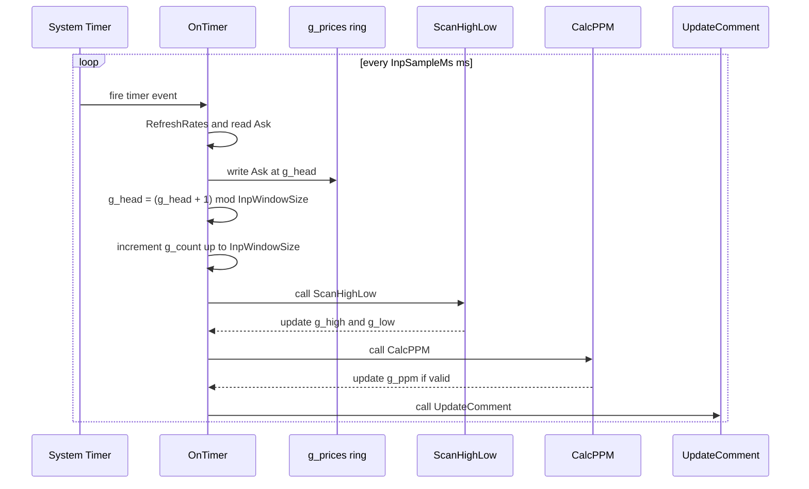
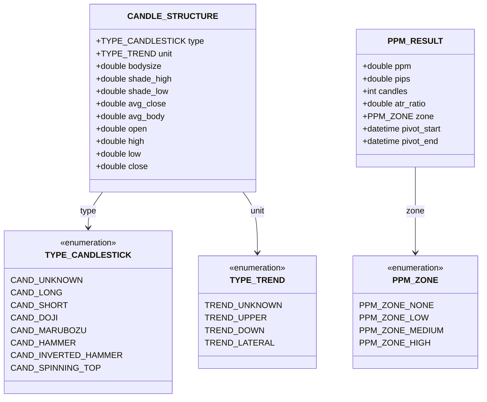
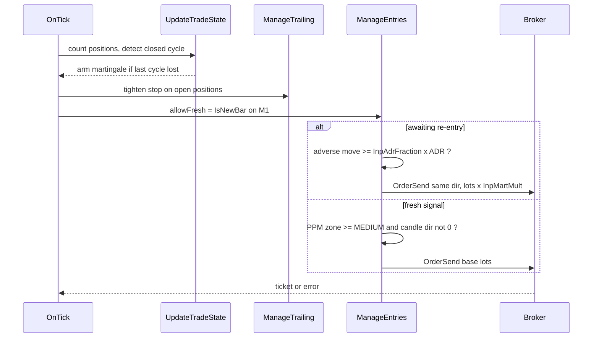

# OneMinuteMan

> **MetaTrader 4 Expert Advisor** — a single-file EA that unifies **three real-time engines** in one non-blocking chart panel: a rolling 1-minute Ask-range scanner, a single-bar candlestick recognizer, and a Pip-Per-Minute (PPM) efficiency engine.

[](https://www.metatrader4.com)
[](https://docs.mql4.com)
[](https://github.com/nhasibuan/oneminuteman)
[](LICENSE)

---

## Table of Contents

- [Product Requirements](#product-requirements)
- [Overview](#overview)
- [Features](#features)
- [Architecture & Blueprint](#architecture--blueprint)
- [Design Patterns & MQL4 Best Practices](#design-patterns--mql4-best-practices)
- [Dataflow](#dataflow)
- [Installation](#installation)
- [Input Parameters](#input-parameters)
- [Data Dictionary](#data-dictionary)
- [Candle Classification Rules](#candle-classification-rules)
- [PPM Efficiency Engine](#ppm-efficiency-engine)
- [Trade Management & Money Management](#trade-management--money-management)
- [Strategy Synthesis](#strategy-synthesis)
- [SWOT Analysis](#swot-analysis)
- [On-Chart Panel](#on-chart-panel)
- [User Guide](#user-guide)
- [Troubleshooting](#troubleshooting)
- [Known Limitations](#known-limitations)
- [References](#references)
- [License](#license)

---

## Product Requirements

### PRD — OneMinuteMan EA

#### Problem Statement

Manual traders monitoring short-term price action on MetaTrader 4 have no native, non-blocking tool that simultaneously (a) tracks the intrabar price range at sub-minute resolution, (b) classifies the most recently closed bar into a named candlestick pattern with trend context, and (c) quantifies how *efficiently* price is travelling (pips per minute) between swing pivots. Existing solutions require several separate indicators, introduce UI-blocking alert dialogs, or rely on architecturally unsafe infinite loops inside `OnInit()`.

#### Goals

| # | Goal | Success Metric |
|---|---|---|
| G1 | Track rolling 1-minute Ask price range in real time | High and low updated within `InpSampleMs` ms of a price change |
| G2 | Classify the last closed bar into a named single-candle pattern | Pattern identified within one tick of bar close |
| G3 | Measure movement efficiency (PPM) between the two most recent ZigZag pivots | PPM + zone recomputed every timer tick |
| G4 | Display range, pattern, and PPM data on chart without blocking the UI | Single `Comment()` overlay — zero modal popups |
| G5 | Provide a clean, extensible entry point for order logic | `OnTick()` exposes `g_high`, `g_low`, `g_candle`, `g_ppm` for trade logic |
| G6 | Adhere to MQL4 best practices (event-driven, no `while(1)`) | Compiles with `#property strict`; EA removes cleanly |

#### Non-Goals

- Does **not** guarantee profit — the martingale re-entry can compound losses; use a hard equity stop (see [SWOT](#swot-analysis))
- Does **not** implement multi-candle patterns (Engulfing, Harami, Star composites)
- Does **not** draw chart objects/labels — all output is via `Comment()`
- Does **not** support MQL5 / MetaTrader 5 natively (separate port required)
- Does **not** persist data between EA restarts (in-memory only)

#### User Stories

| ID | As a… | I want to… | So that… |
|---|---|---|---|
| US-01 | Scalp trader | See the 1-minute Ask high/low live on chart | I can gauge intrabar volatility at a glance |
| US-02 | Price action trader | Know the candlestick type of the last closed bar | I can confirm or reject a setup without switching tools |
| US-03 | Efficiency trader | See the PPM (pips/minute) of the current swing leg | I only engage moves that clear my efficiency threshold |
| US-04 | EA developer | Have a clean `OnTick()` entry point with range + pattern + PPM data | I can add order logic without restructuring the EA |
| US-05 | MT4 user | Remove the EA without freezing the terminal | The EA lifecycle is correctly managed |

#### Functional Requirements

| ID | Requirement | Priority |
|---|---|---|
| FR-01 | Sample Ask price every `InpSampleMs` ms via `EventSetMillisecondTimer` | Must Have |
| FR-02 | Maintain circular buffer of `InpWindowSize` samples | Must Have |
| FR-03 | Compute true rolling high/low from buffer on every timer tick | Must Have |
| FR-04 | Detect new bar open once per bar via static datetime guard | Must Have |
| FR-05 | Classify last closed bar using 7-rule priority chain | Must Have |
| FR-06 | Compute PPM from the two most recent M1 ZigZag pivots (2-2-1) each timer tick | Must Have |
| FR-07 | Classify PPM into LOW / MEDIUM / HIGH zones against configurable thresholds | Must Have |
| FR-08 | Display merged range + candle + PPM panel via `Comment()` | Must Have |
| FR-09 | Log bar classification (with PPM + zone) to the Experts journal via `Print()` | Should Have |
| FR-10 | Validate all inputs in `OnInit()`; return `INIT_PARAMETERS_INCORRECT` on failure | Must Have |
| FR-11 | Kill timer and clear comment on `OnDeinit()` | Must Have |

#### Non-Functional Requirements

| ID | Requirement |
|---|---|
| NFR-01 | Compiles with `#property strict` — zero warnings |
| NFR-02 | Single `.mq4` file — no external `.mqh` dependencies |
| NFR-03 | Circular buffer write is O(1); no O(n) array shifts |
| NFR-04 | `DBL_MAX` / `-DBL_MAX` sentinels — instrument-agnostic (JPY, indices, crypto CFDs) |
| NFR-05 | Broker-agnostic pip normalization (3/4/5-digit brokers) |
| NFR-06 | No `Alert()`, `MessageBox()`, or blocking calls in timer/tick handlers |
| NFR-07 | `EventKillTimer()` always paired with `EventSetMillisecondTimer()` |
| NFR-08 | PPM engine reuses the platform's standard `ZigZag` via `iCustom` — no reimplementation |

---

## Overview

**OneMinuteMan** is a single-file MQL4 Expert Advisor (`oneminuteman.mq4`) that merges **three independent engines** behind one event loop and one chart panel:

1. **Range Scanner** — samples Ask every `InpSampleMs` (default 50 ms) into a circular buffer and continuously reports the rolling 1-minute high/low. Timeframe-independent (pure Ask sampling).
2. **Candlestick Recognizer** — on each new **M1** bar open, classifies the just-closed M1 bar into one of 7 named single-candle patterns with SMA trend context.
3. **PPM Efficiency Engine** — every timer tick, scans the two most recent **M1 ZigZag** pivots and computes *Pip-Per-Minute* efficiency, an ATR multiple, and a LOW/MEDIUM/HIGH entry zone.

All three run concurrently through the standard MQL4 event handlers (`OnInit` / `OnTimer` / `OnTick` / `OnDeinit`) and publish their results into shared globals (`g_high`, `g_low`, `g_candle`, `g_ppm`) that drive the built-in **trade module** — entry, trailing stop, take profit, and ADR-spaced martingale re-entry.

> **Forced 1-minute context (v6.00):** every engine is pinned to M1 regardless of the chart timeframe — the Range Scanner's 60 s rolling window, the Candle Recognizer (`RecognizeCandle` reads `PERIOD_M1`), the new-bar guard (`IsNewBar` tracks `PERIOD_M1`), and the PPM engine (`iCustom` on `PERIOD_M1`) all describe the same minute. Attaching to an M1 chart is still recommended so the on-chart visuals match.

---

## Features

- Rolling 1-minute high/low with sub-second resolution (configurable down to 10 ms)
- 7-pattern single-bar candlestick engine: Long, Short, Doji, Marubozu, Hammer, Inverted Hammer, Spinning Top
- Trend classification per bar: Ascending / Descending / Lateral (SMA-based)
- PPM efficiency engine: pips-per-minute over the last M1 ZigZag leg, with ATR multiple and LOW/MEDIUM/HIGH zoning
- Circular buffer — O(1) write, no array shifting
- Unified single-panel `Comment()` overlay — Range block + Candle block + PPM block
- `OnTick()` entry point with `g_high`, `g_low`, `g_candle`, `g_ppm` ready for order logic
- Full input validation with `INIT_PARAMETERS_INCORRECT` guard
- Broker-agnostic pip normalization (3/4/5-digit)
- MQL4 strict-mode compliant — `(ENUM_TIMEFRAMES)_Period` cast for `EnumToString`
- **Forced M1 context** — range, candle, new-bar guard, and PPM all pinned to `PERIOD_M1`
- **Trade module** — confluence entry, fixed SL/TP, and a trailing stop with auto per-symbol profiles (XAU/USD, EUR/USD)
- **ADR-spaced martingale** — re-opens after a losing cycle once price moves a fraction of the Average Daily Range

---

## Architecture & Blueprint

`oneminuteman.mq4` is a single strict-mode Expert Advisor with no external `.mqh` dependencies. It is organized into numbered sections followed by the four standard MQL4 event handlers.

**Code sections**

- **Section 0 — Inputs:** range (`InpSampleMs`, `InpWindowSize`), candle (`InpAverPeriod`), and PPM (`InpZzDepth`, `InpZzDeviation`, `InpZzBackstep`, `InpZzLookback`, `InpPpmMinHigh`, `InpPpmTarget`, `InpAtrDailyRef`, `InpShowPPM`).
- **Section 1 — Constant:** `BUFFER_SIZE = 1202`.
- **Section 2 — Enums:** `TYPE_CANDLESTICK`, `TYPE_TREND`, `PPM_ZONE`.
- **Section 3 — Structs:** `CANDLE_STRUCTURE`, `PPM_RESULT`.
- **Section 4 — Globals:** circular buffer (`g_prices`, `g_head`, `g_count`), rolling range (`g_high`, `g_low`), and the last candle/PPM results with their validity flags (`g_candle`/`g_candle_valid`, `g_ppm`/`g_ppm_valid`).
- **Section 5 — `TFLabel()`:** strict-safe timeframe string.
- **Section 6 — `IsNewBar()`:** static-datetime bar-open guard.
- **Section 7 — `ScanHighLow()`:** circular-buffer range scan with `DBL_MAX` sentinels.
- **Section 8 — helpers:** `CalcShades()`, `CalcAverageClose()`, `CalcAverageBody()`.
- **Section 9 — `RecognizeCandle()`:** the 7-rule priority chain plus trend classification.
- **Section 10 — `CalcPPM()`:** M1 ZigZag pivot scan producing pips-per-candle and an efficiency zone.
- **Sections 11–12 — labels:** `PpmZoneName()`, `CandleTypeName()`, `TrendName()`.
- **Section 13 — `UpdateComment()`:** the unified Range + Candle + PPM panel.

**Event handlers**

- **`OnInit()`** validates inputs, allocates the buffer, and starts the millisecond timer.
- **`OnDeinit()`** kills the timer and clears the comment.
- **`OnTimer()`** samples Ask, updates the rolling range (`ScanHighLow`), recomputes PPM (`CalcPPM`), and refreshes the panel.
- **`OnTick()`** runs the new-bar guard, classifies the closed bar, and logs it to the Experts journal.


---

## Design Patterns & MQL4 Best Practices

The EA is written as a set of deliberate MQL4 design patterns rather than a monolithic script:

1. **Event-driven, no busy loops.** All work happens inside `OnInit`, `OnTimer`, `OnTick`, and `OnDeinit`. There is no `while(1)` inside `OnInit()` — the terminal stays responsive and the EA is removable at any time.
2. **Millisecond timer for sub-tick sampling.** `EventSetMillisecondTimer(InpSampleMs)` drives the range scanner and PPM engine independently of tick arrival, so the rolling range keeps updating even in quiet markets.
3. **Paired resource lifecycle (RAII-style).** Every `EventSetMillisecondTimer()` is matched by `EventKillTimer()` in `OnDeinit()`, and `Comment()` is cleared on exit — no leaked timers or stale overlays.
4. **Fail-fast input validation.** `OnInit()` gates every input and returns `INIT_PARAMETERS_INCORRECT` on any violation (including the invariant `InpZzBackstep < InpZzDepth`) before allocating resources.
5. **Circular ring buffer.** The Ask history is a fixed-size ring: O(1) write at `g_head`, wrap with modulo, `g_count` capped at `InpWindowSize`. No `ArrayShift`/reallocation on the hot path.
6. **Idempotent once-per-bar work.** `IsNewBar()` uses a `static datetime` guard so candle recognition runs exactly once per bar open, not on every tick.
7. **Sentinel-based extremes.** `ScanHighLow()` seeds with `+DBL_MAX` / `-DBL_MAX` so it is correct on any instrument (JPY, metals, indices, crypto CFDs) without hard-coded price assumptions.
8. **Broker-agnostic pip normalization.** `pipSize = (Digits == 3 || Digits == 5) ? Point * 10 : Point;` keeps PPM correct across 3/4/5-digit brokers.
9. **Separation of concerns.** Pure calculators (`ScanHighLow`, `RecognizeCandle`, `CalcPPM`) are isolated from presentation (`UpdateComment`) and from the event glue (`OnTimer`/`OnTick`).
10. **Value objects + validity flags.** `CANDLE_STRUCTURE` and `PPM_RESULT` bundle related data; `g_candle_valid` / `g_ppm_valid` make the "no data yet" state explicit instead of relying on magic numbers.
11. **Reuse platform primitives.** PPM calls the terminal's built-in `ZigZag` through `iCustom` rather than re-implementing pivot detection.
12. **Strict-mode safety.** `#property strict` plus the `(ENUM_TIMEFRAMES)_Period` cast for `EnumToString` — zero warnings, no implicit-conversion surprises.

---

## Dataflow

### 1. System Dataflow

Two independent paths feed one shared display.

- **Timer path (every `InpSampleMs`):** `OnTimer()` calls `RefreshRates()`, writes the current Ask into the circular buffer at `g_head`, advances the index (wrapping at `InpWindowSize`), then runs `ScanHighLow()` to refresh the rolling `g_high`/`g_low` and `CalcPPM()` to refresh the PPM result.
- **Tick path (every price quote):** `OnTick()` checks `IsNewBar()`; when a new bar has opened it calls `RecognizeCandle()`, which loads the last closed bar via `CopyRates`, computes trend, body, and shadows, applies the 7-rule priority chain, updates `g_candle`, and prints a journal line.

Both paths converge on `UpdateComment()`, which paints the non-blocking Range + Candle + PPM overlay. The resulting globals — `g_high`, `g_low`, `g_candle`, and `g_ppm` — are the entry point for order logic inside `OnTick()`.


### 2. Timer Sampling Sequence



### 3. Candle Recognition (priority chain)

`RecognizeCandle()` loads the last closed M1 bar via `CopyRates`, then computes the body size, the upper/lower shadows (`CalcShades`), the SMA close (`CalcAverageClose`), and the mean body (`CalcAverageBody`). It applies the seven classification rules in priority order — later matches override earlier ones — starting from `CAND_LONG` / `CAND_SHORT` (body vs. average body), then `CAND_DOJI` (body vs. high-low range), `CAND_MARUBOZU` (near-zero shadow), `CAND_HAMMER` / `CAND_INVERTED_HAMMER` (shadow asymmetry), and finally `CAND_SPINNING_TOP` (a short body with both shadows larger than the body). Trend is assigned independently by comparing the close to the SMA (Ascending / Descending / Lateral). The full result is returned in a `CANDLE_STRUCTURE`. See [Candle Classification Rules](#candle-classification-rules) for the exact thresholds.

### 4. PPM Efficiency Dataflow

`CalcPPM()` runs on every timer tick. It scans up to `min(InpZzLookback, Bars - 1)` bars — bailing out if fewer than four are available — and reads the standard **ZigZag** via `iCustom` on `PERIOD_M1` using the `InpZzDepth`-`InpZzDeviation`-`InpZzBackstep` parameters, collecting the two most recent non-empty pivots (`pivot1 @ bar1`, `pivot2 @ bar2`).

If two valid pivots exist and are at least one bar apart, it takes the absolute price distance, normalizes it to pips with a broker-aware pip size (`Point × 10` on 3/5-digit brokers, otherwise `Point`), and divides by the candle count between the pivots to get PPM. It also computes `atr_ratio = ppm / InpAtrDailyRef`, then classifies the result: `ppm ≥ InpPpmTarget → HIGH [ENTER]`, `ppm ≥ InpPpmMinHigh → MEDIUM [WATCH]`, otherwise `LOW [AVOID]`. The full result — PPM, pips, candle count, ATR ratio, zone, and both pivot times — is stored in `g_ppm`.


### 5. EA Lifecycle

When the EA is attached, `OnInit()` validates every input (including the invariant `InpZzBackstep < InpZzDepth`) and returns `INIT_PARAMETERS_INCORRECT` on any violation; it then allocates and zero-initializes the buffer and starts the millisecond timer, returning `INIT_FAILED` if the timer cannot start.

While running, the EA services two events: `OnTimer()` (sample Ask → `ScanHighLow` → `CalcPPM` → `UpdateComment`) and `OnTick()` (new-bar guard → `RecognizeCandle` → journal print).

When the EA is removed or the terminal closes, `OnDeinit()` kills the timer and clears the chart comment, leaving no residual state.

### 6. Data Model



### 7. Trade Execution & Martingale Flow



---

## Installation

1. Copy `oneminuteman.mq4` to your MT4 `MQL4/Experts/` folder (**Experts**, not Indicators — this is an EA).
2. In MetaEditor, open the file and press **F7** to compile. Confirm zero errors and zero warnings.
3. Ensure the terminal's standard **ZigZag** custom indicator is present (ships with MT4) — the PPM engine calls it via `iCustom`.
4. In MetaTrader 4, open an **M1** chart (recommended, so all three engines share the same 1-minute context).
5. Enable **AutoTrading** (the EA runs on timer/tick events).
6. Drag the EA from the Navigator panel onto the chart.
7. In the properties dialog, set the inputs as needed, tick **Allow live trading** (harmless — the EA places no orders), and click **OK**. The unified `Comment()` panel appears within the first timer tick.

> **Tip for XAU/USD or EURUSD scalping:** run defaults (`InpSampleMs=50`, `InpWindowSize=1200`, `InpAverPeriod=14`, ZigZag `2-2-1`, `InpPpmMinHigh=2.0`, `InpPpmTarget=4.0`) on M1 for the most responsive range and PPM readout.

---

## Input Parameters

| Parameter | Default | Range / Type | Description |
|---|---|---|---|
| `InpSampleMs` | `50` | int, ≥ 10 | Timer interval in milliseconds. `50 ms × 1200 = 60 s` rolling window at defaults. |
| `InpWindowSize` | `1200` | int, 60 – 20000 | Circular buffer size (sample count). Window duration = `InpWindowSize × InpSampleMs` ms. |
| `InpAverPeriod` | `14` | int, 1 – 500 | Bars used to compute average body size and SMA close for trend direction. |
| `InpZzDepth` | `2` | int, ≥ 1 | ZigZag Depth — minimum bars for a reversal (2 recommended for M1). |
| `InpZzDeviation` | `2` | int | ZigZag Deviation — minimum move (points) for a new pivot. |
| `InpZzBackstep` | `1` | int, ≥ 1 and `< InpZzDepth` | ZigZag Backstep — bars skipped after a pivot to suppress false signals. |
| `InpZzLookback` | `100` | int | Bars scanned back for ZigZag pivots. |
| `InpPpmMinHigh` | `2.0` | double | PPM threshold — at/above = MEDIUM (acceptable); below = LOW (avoid). |
| `InpPpmTarget` | `4.0` | double | PPM target — at/above = HIGH (ideal entry zone). |
| `InpAtrDailyRef` | `1.5` | double | ATR M1 baseline in pips; `atr_ratio = ppm / InpAtrDailyRef`. |
| `InpShowPPM` | `true` | bool | Show/hide the PPM block in the `Comment()` panel. |

### Trade & Martingale Parameters

| Parameter | Default | Type | Description |
|---|---|---|---|
| `InpEnableTrading` | `false` | bool | Master switch — must be `true` to place any order. |
| `InpBaseLots` | `0.01` | double | Base lot size for the first entry of a cycle. |
| `InpSlippage` | `5` | int | Max slippage (points) on `OrderSend`. |
| `InpMagic` | `202506` | int | Magic number tagging this EA's positions. |
| `InpTP_Pips` | `0` | double | Take profit (pips); `0` = auto per-symbol profile. |
| `InpSL_Pips` | `0` | double | Stop loss (pips); `0` = auto per-symbol profile. |
| `InpTrailStart` | `0` | double | Trailing activation (pips); `0` = auto. |
| `InpTrailStep` | `0` | double | Trailing distance behind price (pips); `0` = auto. |
| `InpUseMartingale` | `true` | bool | Re-open in the same direction after a losing cycle. |
| `InpMartMult` | `2.0` | double | Lot multiplier applied at each martingale step. |
| `InpMartMaxSteps` | `5` | int | Max martingale re-entries per cycle. |
| `InpAdrPeriod` | `14` | int | Days used to average the ADR. |
| `InpAdrFraction` | `0.10` | double | Re-entry spacing = this fraction of ADR (pips). |

> **Validation invariant:** `OnInit()` rejects configurations where `InpZzBackstep >= InpZzDepth`.

---

## Data Dictionary

### Enumerations

#### `TYPE_CANDLESTICK`

| Value | Description | Detection Condition |
|---|---|---|
| `CAND_UNKNOWN` | Unclassified | Default — no rule matched |
| `CAND_LONG` | Long body | `bodysize > avgBody × 1.3` |
| `CAND_SHORT` | Short body | `bodysize < avgBody × 0.5` |
| `CAND_DOJI` | Doji | `HL > 0` AND `bodysize < HL × 0.03` |
| `CAND_MARUBOZU` | Marubozu | `bodysize > 0` AND smaller shadow `/ body < 0.01` |
| `CAND_HAMMER` | Hammer | `shade_low > body×2` AND `shade_high < body×0.1` |
| `CAND_INVERTED_HAMMER` | Inverted Hammer | `shade_low < body×0.1` AND `shade_high > body×2` |
| `CAND_SPINNING_TOP` | Spinning Top | `CAND_SHORT` + both shadows `> body` |

#### `TYPE_TREND`

| Value | Condition |
|---|---|
| `TREND_UNKNOWN` | Default |
| `TREND_UPPER` | `close > avg_close` |
| `TREND_DOWN` | `close < avg_close` |
| `TREND_LATERAL` | `close == avg_close` |

#### `PPM_ZONE`

| Value | Condition | Panel Label |
|---|---|---|
| `PPM_ZONE_NONE` | No pivots / insufficient data | `NO DATA` |
| `PPM_ZONE_LOW` | `ppm < InpPpmMinHigh` | `LOW [AVOID]` |
| `PPM_ZONE_MEDIUM` | `ppm >= InpPpmMinHigh` | `MEDIUM [WATCH]` |
| `PPM_ZONE_HIGH` | `ppm >= InpPpmTarget` | `HIGH [ENTER]` |

### `CANDLE_STRUCTURE` Fields

| Field | Type | Description |
|---|---|---|
| `type` | `TYPE_CANDLESTICK` | Classified pattern after full priority chain |
| `unit` | `TYPE_TREND` | Trend direction vs `InpAverPeriod` SMA |
| `bodysize` | `double` | `MathAbs(open - close)` in price units |
| `shade_high` | `double` | Upper shadow length |
| `shade_low` | `double` | Lower shadow length |
| `avg_close` | `double` | SMA close over `InpAverPeriod` |
| `avg_body` | `double` | Mean body size over `InpAverPeriod` |
| `open` / `high` / `low` / `close` | `double` | OHLC of the last closed bar |

### `PPM_RESULT` Fields

| Field | Type | Description |
|---|---|---|
| `ppm` | `double` | Pips-per-minute efficiency of the last ZigZag leg |
| `pips` | `double` | Pip distance of the last ZigZag leg |
| `candles` | `int` | M1 candles spanning the last ZigZag leg |
| `atr_ratio` | `double` | `ppm / InpAtrDailyRef` (volatility multiple) |
| `zone` | `PPM_ZONE` | Efficiency classification |
| `pivot_start` | `datetime` | Older pivot time |
| `pivot_end` | `datetime` | Most recent pivot time |

### Global State Variables

| Variable | Type | Description |
|---|---|---|
| `g_prices[]` | `double[]` | Circular buffer — Ask samples (`BUFFER_SIZE = 1202`) |
| `g_head` | `int` | Next-write index; wraps at `InpWindowSize` |
| `g_count` | `int` | Valid sample count — capped at `InpWindowSize` |
| `g_high` / `g_low` | `double` | Current rolling high / low |
| `g_candle` | `CANDLE_STRUCTURE` | Last classified bar pattern |
| `g_candle_valid` | `bool` | `true` once a bar has been classified |
| `g_ppm` | `PPM_RESULT` | Last PPM computation |
| `g_ppm_valid` | `bool` | `true` once PPM has valid pivots |

### Functions

| Function | Returns | Description |
|---|---|---|
| `TFLabel()` | `string` | Clean TF label (`M1`, `H4`) — casts `_Period` to `ENUM_TIMEFRAMES` |
| `IsNewBar()` | `bool` | `true` once per bar open — static datetime guard |
| `ScanHighLow()` | `void` | Full buffer scan; `DBL_MAX` sentinels |
| `CalcAverageClose(...)` | `double` | SMA close over period |
| `CalcAverageBody(...)` | `double` | Mean body size over period |
| `CalcShades(...)` | `void` | Upper/lower shadow calc for bull and bear bars |
| `RecognizeCandle(...)` | `bool` | Full candle classification — `false` if data insufficient |
| `CalcPPM(...)` | `bool` | PPM from last two M1 ZigZag pivots — `false` if no valid leg |
| `PpmZoneName(...)` | `string` | `PPM_ZONE` → human label |
| `CandleTypeName(...)` | `string` | `TYPE_CANDLESTICK` → human label |
| `TrendName(...)` | `string` | `TYPE_TREND` → human label |
| `UpdateComment()` | `void` | Unified Range + Candle + PPM `Comment()` panel |

---

## Candle Classification Rules

Rules are applied in priority order — later rules override earlier ones:

| Priority | Pattern | Condition |
|---|---|---|
| 1 | `CAND_LONG` | `bodysize > avgBody × 1.3` |
| 2 | `CAND_SHORT` | `bodysize < avgBody × 0.5` |
| 3 | `CAND_DOJI` | `HL > 0` AND `bodysize < HL × 0.03` |
| 4 | `CAND_MARUBOZU` | `bodysize > 0` AND `min(shade_high, shade_low) / body < 0.01` |
| 5 | `CAND_HAMMER` | `shade_low > body × 2` AND `shade_high < body × 0.1` |
| 6 | `CAND_INVERTED_HAMMER` | `shade_high > body × 2` AND `shade_low < body × 0.1` |
| 7 | `CAND_SPINNING_TOP` | current type == `CAND_SHORT` AND both shadows `> body` |

Trend is assigned independently: `close > avg_close → Ascending`, `close < avg_close → Descending`, equal → `Lateral`.

---

## PPM Efficiency Engine

The **Pip-Per-Minute (PPM)** engine measures how efficiently price is travelling between swing pivots. High PPM means a lot of pips in little time — the short-exposure, high-quality moves M1 scalpers want.

**Core formula (per the last M1 ZigZag leg):**
```
PPM = pip distance between the two most recent pivots
      ---------------------------------------------------
              M1 candles between those pivots
```

On M1, one candle ≈ one minute, so PPM is effectively **pips per minute**.

**How it works (`CalcPPM`, runs every timer tick):**
- Scans up to `InpZzLookback` bars for the two most recent non-empty **standard ZigZag** pivots (parameters `InpZzDepth`-`InpZzDeviation`-`InpZzBackstep`, i.e. `2-2-1` by default), read via `iCustom(..., "ZigZag", ...)` on `PERIOD_M1`.
- Normalizes the price distance to pips using broker-aware `pipSize` (`×10` for 3/5-digit brokers).
- Divides by the candle count between pivots to get `ppm`.
- Computes `atr_ratio = ppm / InpAtrDailyRef` as a volatility multiple.
- Classifies the result into a zone.

**Efficiency zones (defaults):**

| Zone | Condition | Meaning |
|---|---|---|
| `LOW [AVOID]` | `PPM < 2.0` | Inefficient — skip |
| `MEDIUM [WATCH]` | `2.0 ≤ PPM < 4.0` | Acceptable — consider with confirmation |
| `HIGH [ENTER]` | `PPM ≥ 4.0` | Ideal efficiency — priority |

> ZigZag is a repainting indicator: the most recent leg can shift until its pivot is confirmed, so treat a fresh PPM reading as provisional until the swing completes.

---

## Trade Management & Money Management

Order execution is gated by `InpEnableTrading` (**off by default**). When enabled, the EA holds at most one position at a time, opens on a confluence signal, protects it with a fixed stop, take profit, and trailing stop, and — if a cycle closes at a loss — re-opens in the same direction using an ADR-spaced martingale progression.

### Entry

A fresh position opens only when, on a **new M1 bar**: (1) PPM efficiency is at least `MEDIUM` (`g_ppm.zone >= PPM_ZONE_MEDIUM`), and (2) the candle yields a non-zero direction via `SignalDirection()` — Hammer → long, Inverted Hammer → short, or a Long/Marubozu body in the direction of the SMA trend. Size is `InpBaseLots`.

### Trailing stop & take profit

Stop loss and take profit are attached at entry from the resolved per-symbol pip distances. On every timer tick, once price has advanced `trailStart` pips in favor, the stop is trailed to `trailStep` pips behind price and is never loosened.

### Suggested per-symbol settings

Auto-selected by `GetSymbolProfile()`; override any value with the matching `Inp*` input. Values are in the EA's point-based pips — for a 2/3-digit Gold quote, 1 pip = `$0.01`.

| Setting | EUR/USD | XAU/USD (Gold) |
|---|---|---|
| Base lot | 0.01 | 0.01 |
| Take profit | 6 pips (`0.0006`) | 150 pips (`$1.50`) |
| Stop loss | 8 pips (`0.0008`) | 250 pips (`$2.50`) |
| Trailing start | 5 pips | 100 pips (`$1.00`) |
| Trailing step | 3 pips | 50 pips (`$0.50`) |
| Typical ADR | ~80 pips | ~2,500 pips (~`$25`) |
| Re-entry spacing (10% ADR) | ~8 pips | ~250 pips (~`$2.50`) |

> These are conservative M1-scalping starting points, **not** optimized values — backtest and forward-test per broker before risking capital.

### Martingale re-entry (ADR-spaced)

After a cycle closes at a loss and `InpUseMartingale` is on, the EA arms a re-entry. It waits until price has moved **against** the previous entry by at least `InpAdrFraction × ADR` pips — ADR is the Average Daily Range from `CalcADR()` over `InpAdrPeriod` days — then re-opens the **same** direction with `lots × InpMartMult`, up to `InpMartMaxSteps` times. A winning cycle resets the progression to step 0.

> **Risk warning:** martingale increases exposure precisely when the strategy is losing. A sustained adverse run escalates lot size geometrically and can blow the account. Keep `InpBaseLots` tiny, cap `InpMartMaxSteps`, and never run it unattended without a hard equity/drawdown stop.

---

## Strategy Synthesis

The three engines are not three separate tools bolted together — they are three complementary questions about the *same* one-minute moment, and a trade only makes sense when all three answers agree. Inside `OnTick()` the globals `g_ppm`, `g_candle`, and `g_high` / `g_low` form a single decision surface; the "strategy" is simply the logic that reads them together rather than in isolation.

### Each engine owns one question

| Engine | Strategic role | The question it answers |
|---|---|---|
| PPM Efficiency | Regime filter / quality gate | *Is the market moving efficiently enough to be worth trading right now?* |
| Candlestick Recognizer | Direction & setup | *Which way — and is there a valid price-action pattern?* |
| Range Scanner | Timing & risk framing | *Where is price inside the live 1-minute range, and where do the stop and target sit?* |

### The layered decision: filter, then trigger, then execute

1. **Filter with PPM (regime).** Stand aside while PPM sits in the `LOW [AVOID]` zone — that is inefficient chop. Only *arm* the strategy when PPM reaches `MEDIUM [WATCH]`, and treat `HIGH [ENTER]` as a priority condition. This is what collapses the day's hundreds of micro-moves into a short list of high-quality candidates, and the ZigZag pivots (`pivot_start → pivot_end`) simultaneously hand you the swing context.
2. **Trigger with the candle (direction).** Once armed, read the last closed M1 bar for the directional trigger. Reversal shapes (Hammer, Inverted Hammer, Doji, Spinning Top) forming *at* a fresh pivot argue for a turn; continuation shapes (Long, Marubozu) argue for momentum. The trend field (Ascending / Descending / Lateral) keeps you from fading a strong leg.
3. **Execute with the range (timing & risk).** The rolling 1-minute high/low is the precise entry reference and the risk envelope: enter on interaction with a boundary (break or rejection), set the stop just beyond the opposite boundary or the swing pivot, and size the target off the current range width. Because the range refreshes every `InpSampleMs`, it naturally matches the 30 s – 2.5 min holding window the PPM philosophy is built around.

### Worked confluence examples

- **Efficient reversal long** — PPM `HIGH` after a down-leg (`pivot_end` is a swing low), the last M1 bar prints a Hammer, trend rotates to Ascending, and Ask is pressing the rolling low → go long, stop below the rolling low, scale out toward the rolling high.
- **Efficient continuation** — PPM `HIGH`, a Marubozu or Long bar in the trend direction, and price breaking the rolling high → momentum entry with the trend, trailing behind the rolling low.
- **Stand aside** — PPM `LOW`, *or* a Doji / Spinning Top under a Lateral trend, *or* a range too tight to pay for the spread → no trade, no matter how tempting the chart looks.

### The unifying thesis — "the one-minute man"

Capture a *single*, high-efficiency, roughly one-minute move. Enter only when efficiency (PPM), price action (candle), and location (range) agree; hold for a short, defined window; exit as efficiency fades. Minimizing time in the market is itself the risk control — the shorter the exposure, the less the position is at the mercy of drift, news, and noise. Each engine covers the others' blind spot: PPM ignores direction, the candle ignores efficiency, and the range ignores both but frames the trade — together they describe one coherent, disciplined scalping decision.

---

## SWOT Analysis

A strategic assessment of the combined three-engine strategy and its v6.00 trade module.

### Strengths

- **Triple confluence** filters noise: a signal must clear efficiency (PPM), pattern (candle), and location (range) before it counts, sharply reducing false positives versus any single engine.
- **Low-latency, event-driven core:** 50 ms Ask sampling and a non-blocking `Comment()` panel suit fast M1 scalping without freezing the terminal.
- **Efficiency-first selection:** PPM concentrates attention on high pip-per-minute moves and screens out low-quality chop.
- **Robust and portable:** `DBL_MAX` sentinels and 3/4/5-digit pip normalization make it instrument- and broker-agnostic.
- **Single, clean decision surface:** all signals converge on shared globals in `OnTick()`, so order logic is trivial to layer on.
- **Short time-in-market** inherently limits exposure to drift, spread creep, and adverse news.
- **Forced-M1 coherence:** range, candle, and PPM now describe the same minute, removing timeframe mismatch.
- **Automated execution:** built-in entry, SL/TP, and trailing stop with auto per-symbol profiles (XAU/USD, EUR/USD).

### Weaknesses

- **ZigZag repaints:** the most recent leg — and therefore the live PPM — is provisional and can lure late entries.
- **Single-bar patterns only:** no multi-bar confirmation (Engulfing, Harami, morning/evening stars).
- **Coarse trend proxy:** an SMA-close comparison flags Lateral on equal closes and ignores slope/strength.
- **Unbounded martingale risk:** lot size grows geometrically after losses; without a hard equity stop a bad run can margin-call the account.
- **Simple, fixed logic:** one position at a time, single-bar entry trigger, and static per-symbol pip targets — unproven without backtesting.
- **Volatile, stateless memory:** buffers and PPM reset on restart, and the millisecond timer can drift under CPU load.

### Opportunities

- **Confirmation layers:** add multi-candle patterns and a higher-timeframe trend filter to strengthen the trigger.
- **Adaptive execution:** PPM- and `atr_ratio`-scaled position sizing and dynamic take-profit targets.
- **Pivot confirmation:** wait for a ZigZag pivot to close before acting to cut repaint risk.
- **Session & news gating:** suppress signals around NFP/FOMC and outside high-liquidity windows to protect PPM validity.
- **Data-driven tuning:** log PPM per symbol to build statistical norms and optimize thresholds; enable backtesting.
- **Risk guards:** add an equity/drawdown stop, daily loss limit, and martingale-off news blackout to contain tail risk.
- **Reach:** an MQL5/MT5 port plus push/mobile alerts for `HIGH [ENTER]` conditions.

### Threats

- **Execution friction:** slippage, requotes, and latency can erase a tight pip-per-minute edge.
- **Spread dynamics:** widening spreads in fast or thin markets distort the pip math and eat small targets.
- **Liquidity gaps:** sparse pivots on illiquid symbols leave PPM stale or in `NO DATA`.
- **Over-trading:** thresholds set too loosely invite churn in ranging conditions, bleeding costs.
- **Microstructure & competition:** M1 noise and faster institutional algos disadvantage a discretionary/manual operator.
- **Martingale ruin:** a trending market that keeps moving against the position chains re-entries into a margin call.
- **Broker/regulatory limits:** some brokers restrict scalping or impose minimum holding times that break the model.

---

## On-Chart Panel

All three engines render into a single non-blocking `Comment()` overlay (no chart objects, no popups). Example:

```text
=== OneMinuteMan v6.00 ===
Symbol:EURUSD  Engines:M1 (forced)  Chart:M1
--- Range (1-min rolling) ---
Window : 60 s (1200 samples @ 50 ms)
Filled : 1200 / 1200
High   : 1.09321
Low    : 1.09280
Range  : 0.00041
Ask    : 1.09305
--- Last Closed Bar ---
Pattern: Doji | Trend: Ascending
Body   : 0.00002  AvgBody: 0.00015
OHLC   : 1.09300 / 1.09322 / 1.09298 / 1.09302
ShadeH : 0.00020  ShadeL: 0.00002
--- PPM Efficiency (M1 ZigZag 2-2-1) ---
PPM    : 3.20  [min:2.0 target:4.0]
Pips   : 16.0  Candles: 5
ATR x  : 2.1  (ATR ref: 1.5 pip)
Zone   : MEDIUM [WATCH]
Pivot  : 14:20  >>  14:25
--- Trade / Money Mgmt ---
Trading: OFF  Magic:202506
TP:6 SL:8 Trail:5/3 pips
Open:0  Mart:0/5 
ADR:82 pips  Re-entry@8 pips
```

The Experts journal also receives one `Print()` line per new bar with the candle type, trend, OHLC, and current PPM + zone.

---

## User Guide

### Chart Setup

- **Timeframe:** M1 (1-minute) — recommended so the chart-TF candle engine and the M1-locked PPM engine agree.
- **Symbol:** any forex pair or instrument (EURUSD, GBPUSD, XAUUSD work well).
- **AutoTrading:** must be enabled for the EA's event handlers to fire.

### Recommended Configurations

**Conservative (more signals):**
- `InpPpmMinHigh = 1.5`, `InpPpmTarget = 3.0`

**Balanced (defaults):**
- `InpPpmMinHigh = 2.0`, `InpPpmTarget = 4.0`

**Ultra-selective (premium only):**
- `InpPpmMinHigh = 3.0`, `InpPpmTarget = 5.0`

Actual signal counts depend on symbol volatility and session — establish per-symbol norms by logging PPM over time.

### Interpreting the Panel

- **Range block:** current 1-minute high/low, span, and how full the buffer is. Wide range = high intrabar volatility.
- **Candle block:** the last closed bar's pattern and trend. Use it to confirm/reject a setup.
- **PPM block:** the efficiency of the current swing leg and its zone. `HIGH [ENTER]` is a priority condition; `LOW [AVOID]` says the move is inefficient.

### Suggested Entry Workflow (manual)

1. **Efficiency:** wait for PPM zone `MEDIUM` or `HIGH`.
2. **Direction:** a swing high forming with high PPM → potential SHORT; a swing low → potential LONG.
3. **Confirmation:** align with the candle pattern/trend (e.g. Hammer + Ascending for longs).
4. **Time management:** target very short holds (≈ 30 s – 2.5 min); exit if PPM drops back into `LOW`.

### Risk Management

- Keep lot sizes small for M1 scalping; risk ≈ 1–2% per trade.
- Place stops beyond the previous swing pivot (5–10 pips majors; wider for XAUUSD).
- Factor spread into targets; trade low-spread sessions (e.g. London/NY overlap).
- Avoid major news releases — volatility distorts PPM.

### Extending into a Trading EA

`OnTick()` is the intended hook. After `RecognizeCandle`, the globals `g_high`, `g_low`, `g_candle`, and `g_ppm` (with `g_ppm_valid`) are populated — add `OrderSend`/position logic there, e.g. only trade when `g_ppm.zone == PPM_ZONE_HIGH` and the candle confirms direction.

---

## Troubleshooting

#### Panel not showing / EA not running
- Confirm **AutoTrading** is enabled and the EA shows a smiley face on the chart.
- Recompile in MetaEditor (F7) and check for a green "0 errors, 0 warnings".
- Check the Experts/Journal tabs for the `OneMinuteMan v5.00 initialized...` line.

#### PPM stuck on `Calculating PPM...` or `NO DATA`
- The standard **ZigZag** indicator must exist in `MQL4/Indicators/` (it ships with MT4).
- Load more M1 history (scroll left / lower timeframe once) so at least two pivots exist within `InpZzLookback`.
- On very quiet symbols, pivots are sparse — increase `InpZzLookback`.

#### PPM values look wrong
- Verify broker digits (3/4/5) — pip normalization keys off `Digits`.
- Confirm ZigZag params match your intent (`2-2-1` default); remember `InpZzBackstep` must be `< InpZzDepth`.

#### EA fails to initialize
- `INIT_PARAMETERS_INCORRECT` means an input is out of range — check `InpSampleMs ≥ 10`, `InpWindowSize 60–20000`, `InpAverPeriod 1–500`, ZigZag params `≥ 1`, and `InpZzBackstep < InpZzDepth`.

---

## Known Limitations

| # | Limitation | Notes |
|---|---|---|
| 1 | Single-bar patterns only | Multi-candle composites (Engulfing, Harami, Star) require extra lookback in `OnTick()` |
| 2 | SMA trend — not directional | Equal close prices → `TREND_LATERAL` regardless of bar direction |
| 3 | In-memory only | Buffer, candle, and PPM state reset on EA restart or terminal close |
| 4 | Timer drift under load | `EventSetMillisecondTimer` is best-effort — intervals may drift under high CPU |
| 5 | Ask-only sampling | Replace `Ask` with `Bid` in `OnTimer()` for bid-based instruments |
| 6 | PPM is M1-locked | `CalcPPM` hard-codes `PERIOD_M1`; the candle engine uses the chart TF, so run on M1 for coherence |
| 7 | Depends on standard ZigZag | PPM needs the built-in `ZigZag` custom indicator available for `iCustom` |
| 8 | ZigZag repaints | The most recent swing leg (and its PPM) can change until the pivot is confirmed |

---

## References

- [MQL4 Reference — EventSetMillisecondTimer](https://docs.mql4.com/eventfunctions/eventsetmillisecondtimer)
- [MQL4 Reference — CopyRates](https://docs.mql4.com/series/copyrates)
- [MQL4 Reference — iCustom](https://docs.mql4.com/indicators/icustom)
- [MQL5 Article — Analyzing Candlestick Patterns](https://www.mql5.com/en/articles/101)
- [MQL4 Reference — ENUM_TIMEFRAMES](https://docs.mql4.com/constants/chartconstants/enum_timeframes)

---

## Version History

**v6.00** (current)
- Forced 1-minute context: range, candle recognizer, new-bar guard, and PPM all pinned to `PERIOD_M1`
- Added a trade module: confluence entry, fixed SL/TP, trailing stop, and auto per-symbol profiles (XAU/USD, EUR/USD)
- Added ADR-spaced martingale re-entry (`InpUseMartingale`, `InpMartMult`, `InpMartMaxSteps`, `InpAdrPeriod`, `InpAdrFraction`)
- Data-model class diagram + trade-execution sequence diagram; documentation limited to UML class/sequence diagrams

**v5.00**
- Unified single-EA design: Range Scanner + Candlestick Recognizer + PPM Efficiency engine share one event loop and one `Comment()` panel
- PPM engine added (`CalcPPM`, `PPM_RESULT`, `PPM_ZONE`) using the standard M1 ZigZag via `iCustom`
- Broker-agnostic pip normalization and ATR-multiple readout
- Documentation harmonized to match the shipped code

---

## Credits

**Developer:** Norman Hasibuan (nhasibuan)

**Strategy Concept:** Bionics Trading Algorithms — Pip Per Minute (PPM) methodology

**References:**
- MQL4 Documentation: https://docs.mql4.com/
- ZigZag Indicator Analysis: https://www.mql5.com/en/articles/101
- PPM Trading Theory: NotebookLM source analysis

---

## License

MIT License — see the LICENSE file for details.
