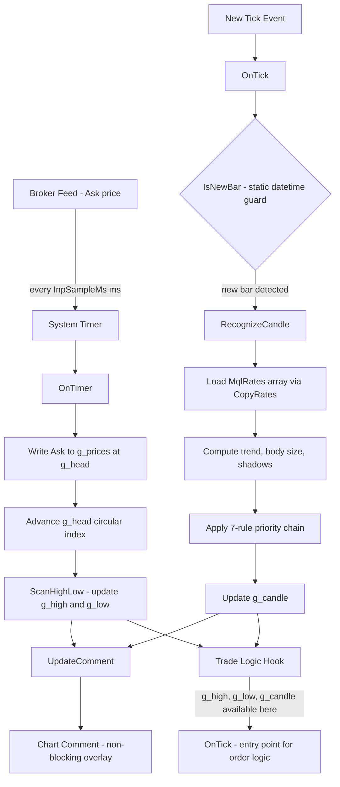
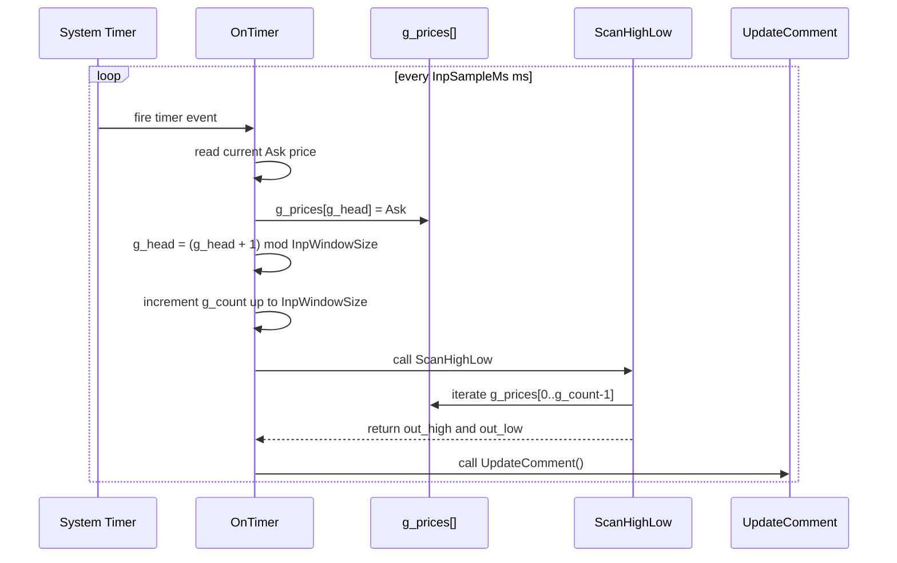
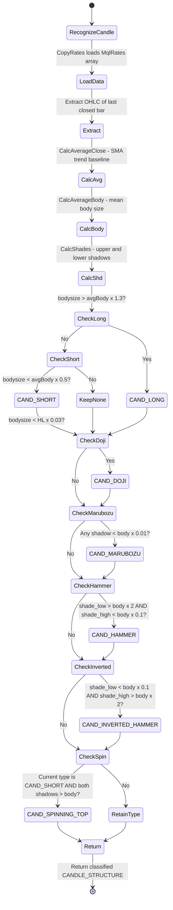
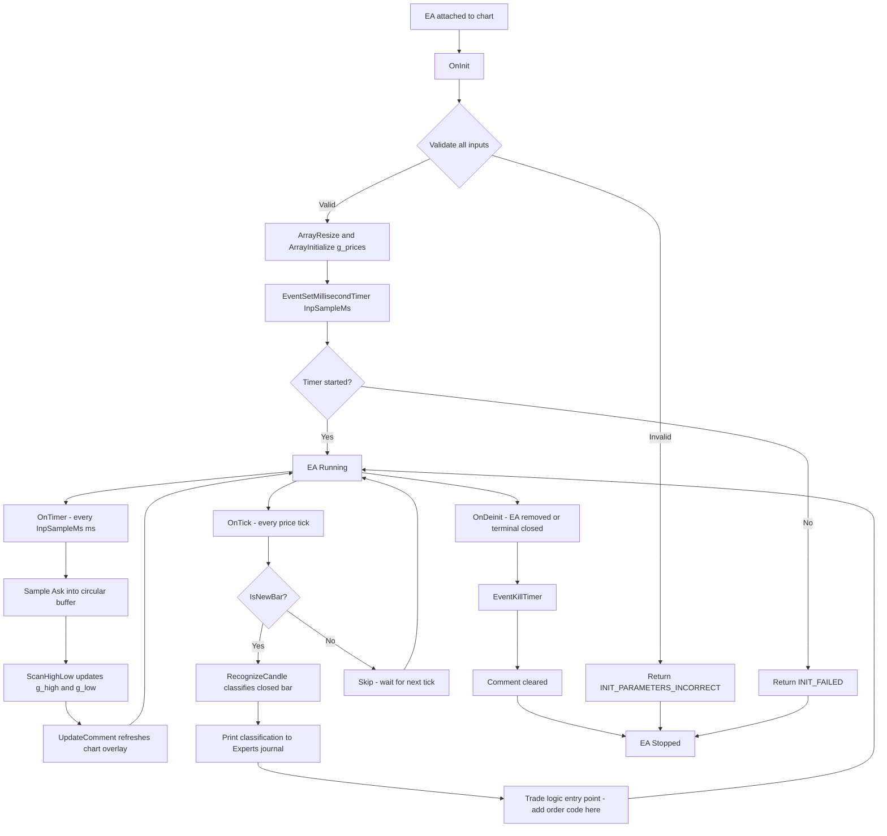

# OneMinuteMan

> **MetaTrader 4 Expert Advisor** — Rolling 1-minute price range scanner with single-bar candlestick pattern recognition engine.

[](https://www.metatrader4.com)
[](https://docs.mql4.com)
[](https://github.com/nhasibuan/oneminuteman)
[](LICENSE)

---

## Table of Contents

- [Product Requirements](#product-requirements)
- [Overview](#overview)
- [Features](#features)
- [Architecture & Blueprint](#architecture--blueprint)
- [Dataflow](#dataflow)
- [Installation](#installation)
- [Input Parameters](#input-parameters)
- [Data Dictionary](#data-dictionary)
- [Candle Classification Rules](#candle-classification-rules)
- [Known Limitations](#known-limitations)

---

## Product Requirements

### PRD — OneMinuteMan EA

#### Problem Statement

Manual traders monitoring short-term price action on MetaTrader 4 have no native, non-blocking tool that simultaneously tracks the intrabar price range (sub-minute resolution) and classifies the most recently closed bar into a named candlestick pattern with trend context. Existing solutions require separate indicators, introduce UI-blocking alert dialogs, or rely on architecturally unsafe infinite loops inside `OnInit()`.

#### Goals

| # | Goal | Success Metric |
|---|---|---|
| G1 | Track rolling 1-minute Ask price range in real time | High and low updated within 50 ms of price change |
| G2 | Classify the last closed bar into a named single-candle pattern | Pattern identified correctly within one tick of bar close |
| G3 | Display both range and pattern data on chart without blocking UI | `Comment()` overlay — zero modal popups |
| G4 | Provide clean, extensible entry point for order logic | `OnTick()` exposes `g_high`, `g_low`, `g_candle` for trade logic |
| G5 | Adhere to MQL4 best practices (event-driven, no `while(1)`) | Compiles with `#property strict`; EA removable cleanly |

#### Non-Goals

- Does **not** place, modify, or close orders (scaffolding only)
- Does **not** implement multi-candle patterns (Engulfing, Harami, Star composites)
- Does **not** support MQL5 / MetaTrader 5 natively (separate port required)
- Does **not** persist data between EA restarts (in-memory only)

#### User Stories

| ID | As a… | I want to… | So that… |
|---|---|---|---|
| US-01 | Scalp trader | See the 1-minute Ask high/low live on chart | I can gauge intrabar volatility at a glance |
| US-02 | Price action trader | Know the candlestick type of the last closed bar | I can confirm or reject a setup without switching tools |
| US-03 | EA developer | Have a clean `OnTick()` entry point with range + pattern data | I can add order logic without restructuring the EA |
| US-04 | MT4 user | Remove the EA without freezing the terminal | The EA lifecycle is correctly managed |

#### Functional Requirements

| ID | Requirement | Priority |
|---|---|---|
| FR-01 | Sample Ask price every `InpSampleMs` ms via `EventSetMillisecondTimer` | Must Have |
| FR-02 | Maintain circular buffer of `InpWindowSize` samples | Must Have |
| FR-03 | Compute true rolling high and low from buffer on every timer tick | Must Have |
| FR-04 | Detect new bar open once per bar via static datetime guard | Must Have |
| FR-05 | Classify last closed bar using 7-rule priority chain | Must Have |
| FR-06 | Display merged range + candle panel via `Comment()` | Must Have |
| FR-07 | Log bar classification to Experts journal via `Print()` | Should Have |
| FR-08 | Validate all inputs in `OnInit()`; return `INIT_PARAMETERS_INCORRECT` on failure | Must Have |
| FR-09 | Kill timer and clear comment on `OnDeinit()` | Must Have |
| FR-10 | Support configurable averaging period for body/trend baseline | Should Have |

#### Non-Functional Requirements

| ID | Requirement |
|---|---|
| NFR-01 | Compiles with `#property strict` — zero warnings |
| NFR-02 | Single `.mq4` file — no external `.mqh` dependencies |
| NFR-03 | Circular buffer write is O(1); no O(n) array shifts |
| NFR-04 | `DBL_MAX` / `-DBL_MAX` sentinels — instrument-agnostic (works on JPY, indices, crypto CFDs) |
| NFR-05 | No `Alert()`, `MessageBox()`, or blocking calls in timer/tick handlers |
| NFR-06 | `EventKillTimer()` always paired with `EventSetMillisecondTimer()` |

---

## Overview

**OneMinuteMan** is a single-file MQL4 Expert Advisor that merges two independent engines:

1. **Range Scanner** — samples Ask every 50 ms into a circular buffer and continuously reports the rolling 1-minute high/low.
2. **Candlestick Recognizer** — on each new bar open, classifies the just-closed bar into one of 9 named single-candle patterns with trend context.

Both engines run concurrently via separate event handlers and expose their results through shared globals ready for trade signal logic.

---

## Features

- Rolling 1-minute high/low with sub-second resolution (configurable down to 10 ms)
- 9-pattern single-bar candlestick engine: Doji, Hammer, Inverted Hammer, Marubozu, Long, Short, Spinning Top, Star (reserved)
- Trend classification per bar: Ascending / Descending / Lateral (SMA-based)
- Circular buffer — O(1) write, no array shifting
- Live dual-panel `Comment()` overlay — range block + candle block
- `OnTick()` entry point with `g_high`, `g_low`, `g_candle` ready for order logic
- Full input validation with `INIT_PARAMETERS_INCORRECT` guard
- MQL4 strict-mode compliant — `(ENUM_TIMEFRAMES)_Period` cast for `EnumToString`

---

## Architecture & Blueprint

```
oneminuteman.mq4 (212 lines)
  │
  ├── [Constants] BUFFER_SIZE = 1202
  ├── [Inputs] InpSampleMs | InpWindowSize | InpAverPeriod
  ├── [Enums] TYPE_CANDLESTICK (8) | TYPE_TREND (4)
  ├── [Struct] CANDLE_STRUCTURE (type + unit + bodysize + shadows + OHLC)
  ├── [Globals] g_prices[] | g_head | g_count | g_high | g_low | g_candle
  │
  ├── Section 1 TFLabel() — safe timeframe string (strict-mode fix)
  ├── Section 2 IsNewBar() — bar-open guard (static datetime)
  ├── Section 3 ScanHighLow() — O(n) range scan with DBL_MAX sentinels
  ├── Section 4 CalcShades() — upper/lower shadow extraction
  │             CalcAverageClose() — SMA for trend baseline
  │             CalcAverageBody() — average body for size classification
  │             RecognizeCandle() — main 7-rule classification function
  ├── Section 5 CandleTypeName() — enum to string
  │             TrendName() — enum to string
  ├── Section 6 UpdateComment() — merged dual-panel chart overlay
  │
  ├── OnInit()    validate → allocate → EventSetMillisecondTimer()
  ├── OnDeinit()  EventKillTimer() → Comment("")
  ├── OnTimer()   sample Ask → write buffer → ScanHighLow → UpdateComment
  └── OnTick()    IsNewBar guard → RecognizeCandle → Print log → trade entry
```

---

## Dataflow

### 1. System Dataflow



### 2. Circular Buffer Write Sequence



### 3. Candle Recognition State Flow



### 4. EA Lifecycle



---

## Installation

1. Copy `oneminuteman.mq4` to your MT4 `MQL4/Experts/` folder.
2. In MetaEditor, open the file and press **F7** to compile. Confirm zero errors and zero warnings.
3. In MetaTrader 4, open a chart (any symbol / timeframe).
4. Drag the EA from the Navigator panel onto the chart.
5. In the EA properties dialog, set `InpSampleMs`, `InpWindowSize`, `InpAverPeriod` as needed and enable **Allow live trading**.
6. Click **OK**. The dual-panel `Comment()` overlay appears on the chart within the first timer tick.

> **Tip for XAU/USD scalping:** Use default settings (`InpSampleMs=50`, `InpWindowSize=1200`, `InpAverPeriod=10`) on M1 for the most responsive 1-minute range. For H1 candle pattern context, attach a second instance with `InpAverPeriod=20` on an H1 chart.

---

## Input Parameters

| Parameter | Default | Range | Description |
|---|---|---|---|
| `InpSampleMs` | `50` | ≥ 10 | Timer interval in milliseconds. `50 ms × 1200 = 60 s` rolling window at defaults. |
| `InpWindowSize` | `1200` | 60 – 20000 | Circular buffer size (sample count). Window duration = `InpWindowSize × InpSampleMs` ms. |
| `InpAverPeriod` | `14` | 1 – 500 | Bars used to compute average body size and SMA close for trend direction. |

---

## Data Dictionary

### Enumerations

#### `TYPE_CANDLESTICK`

| Value | Description | Detection Condition |
|---|---|---|
| `CAND_UNKNOWN` | Unclassified | Default — no rule matched |
| `CAND_DOJI` | Doji | `bodysize < HL × 0.03` |
| `CAND_SHORT` | Short body | `bodysize < avgBody × 0.5` |
| `CAND_LONG` | Long body | `bodysize > avgBody × 1.3` |
| `CAND_MARUBOZU` | Marubozu | Either shadow `< body × 0.01` |
| `CAND_HAMMER` | Hammer | `shade_low > body×2` AND `shade_high < body×0.1` |
| `CAND_INVERTED_HAMMER` | Inverted Hammer | `shade_low < body×0.1` AND `shade_high > body×2` |
| `CAND_SPINNING_TOP` | Spinning Top | `CAND_SHORT` + both shadows `> body` |

#### `TYPE_TREND`

| Value | Condition |
|---|---|
| `TREND_UNKNOWN` | Default |
| `TREND_UPPER` | `close > avg_close` |
| `TREND_DOWN` | `close < avg_close` |
| `TREND_LATERAL` | `close == avg_close` |

### `CANDLE_STRUCTURE` Fields

| Field | Type | Description |
|---|---|---|
| `type` | `TYPE_CANDLESTICK` | Classified pattern after full priority chain |
| `unit` | `TYPE_TREND` | Trend direction vs `InpAverPeriod` SMA |
| `bodysize` | `double` | `MathAbs(open - close)` in price units |
| `shade_high` | `double` | Upper shadow length |
| `shade_low` | `double` | Lower shadow length |
| `avg_close` | `double` | SMA close over `InpAverPeriod` |
| `avg_body` | `double` | Mean body size over `InpAverPeriod` |
| `open` | `double` | Bar open price |
| `high` | `double` | Bar high price |
| `low` | `double` | Bar low price |
| `close` | `double` | Bar close price |

### Global State Variables

| Variable | Type | Description |
|---|---|---|
| `g_prices[]` | `double[]` | Circular buffer — `InpWindowSize` Ask samples |
| `g_head` | `int` | Next-write index; wraps at `InpWindowSize` |
| `g_count` | `int` | Valid sample count — capped at `InpWindowSize` |
| `g_high` | `double` | Current rolling high |
| `g_low` | `double` | Current rolling low |
| `g_candle` | `CANDLE_STRUCTURE` | Last classified bar pattern |

### Functions

| Function | Returns | Description |
|---|---|---|
| `TFLabel()` | `string` | Clean TF label (`M1`, `H4`) — casts `_Period` to `ENUM_TIMEFRAMES` |
| `IsNewBar()` | `bool` | `true` once per bar open — static datetime guard |
| `ScanHighLow()` | `void` | Full buffer scan; `DBL_MAX` sentinels |
| `CalcAverageClose(...)` | `double` | SMA close over period |
| `CalcAverageBody(...)` | `double` | Mean body size over period |
| `CalcShades(...)` | `void` | Upper/lower shadow calc for bull and bear bars |
| `RecognizeCandle(...)` | `bool` | Full candle classification — `false` if data insufficient |
| `CandleTypeName(...)` | `string` | `TYPE_CANDLESTICK` → human label |
| `TrendName(...)` | `string` | `TYPE_TREND` → human label |
| `UpdateComment()` | `void` | Merged dual-panel `Comment()` overlay |

---

## Candle Classification Rules

Rules are applied in priority order — later rules override earlier ones:

| Priority | Pattern | Condition |
|---|---|---|
| 1 | `CAND_LONG` | `bodysize > avgBody × 1.3` |
| 2 | `CAND_SHORT` | `bodysize < avgBody × 0.5` |
| 3 | `CAND_DOJI` | `HL > 0` AND `bodysize < HL × 0.03` |
| 4 | `CAND_MARUBOZU` | `bodysize > 0` AND (lower OR upper shadow `< body × 0.01`) |
| 5 | `CAND_HAMMER` | `shade_low > body × 2` AND `shade_high < body × 0.1` |
| 6 | `CAND_INVERTED_HAMMER` | `shade_low < body × 0.1` AND `shade_high > body × 2` |
| 7 | `CAND_SPINNING_TOP` | current type == `CAND_SHORT` AND both shadows `> body` |

---

## Known Limitations

| # | Limitation | Notes |
|---|---|---|
| 1 | Single-bar patterns only | Multi-candle composites (Engulfing, Harami, Star) require additional lookback in `OnTick()` |
| 2 | SMA trend — not directional | Equal close prices → `TREND_LATERAL` regardless of bar direction |
| 3 | In-memory only | Buffer resets on EA restart or terminal close |
| 4 | Timer drift under load | `EventSetMillisecondTimer` is best-effort — intervals may drift under high CPU |
| 5 | Ask-only sampling | Replace `Ask` with `Bid` in `OnTimer()` for bid-based instruments |
| 6 | No multi-threading | Single-threaded — heavy computation in `OnTick()` can delay timer callbacks |

---

## References

- [MQL4 Reference — EventSetMillisecondTimer](https://docs.mql4.com/eventfunctions/eventsetmillisecondtimer)
- [MQL4 Reference — CopyRates](https://docs.mql4.com/series/copyrates)
- [MQL5 Article — Analyzing Candlestick Patterns](https://www.mql5.com/en/articles/101)
- [MQL4 Reference — ENUM_TIMEFRAMES](https://docs.mql4.com/constants/chartconstants/enum_timeframes)
